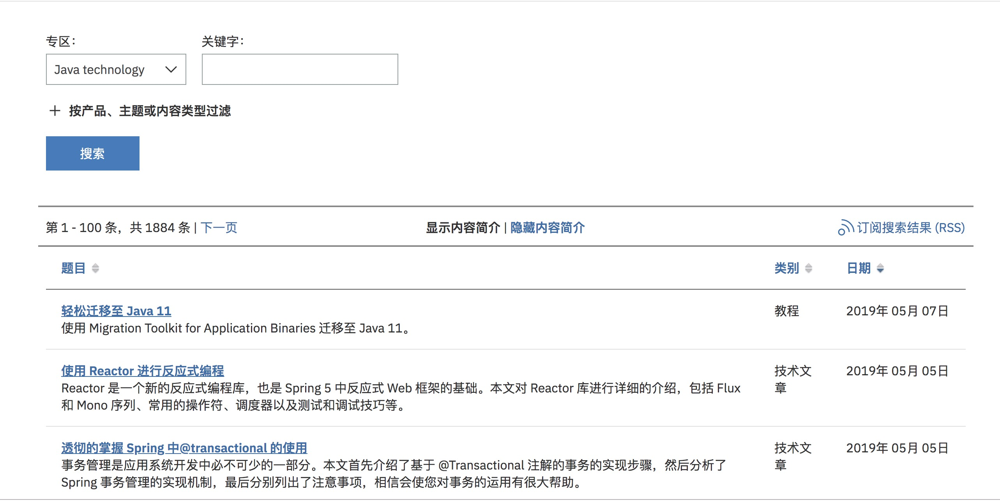

## 数据结构

使用类似v2ex论坛的模式

每个wiki可以属于多个标签，只能属于一个节点

## 界面设计

默认首页 左上角可以新建页面，新建节点。新建页面时可以新建标签。

未登录时左侧为最新发布、全部的节点列表

登录后左侧显示 全部、关注，默认为关注，没有关注时默认为全部

个人中心：我的发布、文章收藏、我的评论

右侧为文章为卡片式，暂定为如下格式，标题 + 作者 + 时间 + 最后回复 + 内容摘要

详细页面

左侧为目录、系列文章，右上角有编辑，收藏，历史版本。

发布时可选择与哪篇文章组成一个系列（使用 ? 标注功能说明）

搜索

搜索过滤条件有 节点、标签、作者、时间，节点和标签过多时只显示一部分，点更多显示全部

时间过滤为  今天、昨天、最近七天、最近一个月、最近一年、自定义

新建分组

