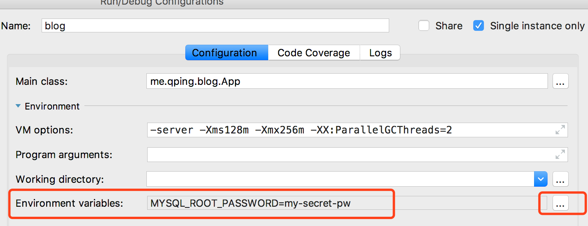

1、 docker 安装 mysql 后，通过 navicat 连接时，出错：2059 - Authentication plugin 'caching_sha2_password' cannot be loaded: dlopen(../Frameworks/caching_sha2_password.so, 2): image not found

**尝试一**：mysql8.0修改了默认的身份验证插件：caching_sha2_password，需要更新下密码算法。

```
mysql> select user,host,authentication_string from mysql.user;
mysql> ALTER user 'root'@'%' IDENTIFIED BY '123456' PASSWORD EXPIRE NEVER;
mysql> ALTER user 'root'@'%' IDENTIFIED WITH mysql_native_password BY '123456';
mysql> FLUSH PRIVILEGES;
```

参考链接：<https://www.jianshu.com/p/0be40c133926>

navicat连接不报错，可建库，但java连接出错。


**解**：使用mariadb

``` bash
docker pull mariadb
docker run --name some-mariadb -e MYSQL_ROOT_PASSWORD=my-secret-pw -p 3306:3306 -d mariadb
```


2、使用 jmap -heap \<pid> 时，出错：Error attaching to process: sun.jvm.hotspot.debugger.DebuggerException: Can't attach symbolicator to the process

**尝试一**：可能是java进程由root创建，使用su - root后重新运行 jmap \<pid> 。仍然报错


**解**：疑似JDK8 bug，放弃

参考连接：<https://bugs.java.com/bugdatabase/view_bug.do?bug_id=8160743>


发现maven build配置中，java 编译版本为1.7，而我的系统jdk是1.8，可能是这原因。


3、阿里云初始化系统为ubuntu后登陆不上

删除 /Users/qping/.ssh/known_hosts 中之前域名记录。重新 ssh root@blog.qping.me 登陆，使用安装系统盘时设置的密码（通过阿里云的管理界面无法修改密码！）

设置密钥登陆，下次不用再输密码了

```
[root@host ~]$ cd .ssh
[root@host .ssh]$ cat id_rsa.pub >> authorized_keys
```

编辑 /etc/ssh/sshd_config 文件，进行如下设置：

```
RSAAuthentication yes
PubkeyAuthentication yes
```

另外，请留意 root 用户能否通过 SSH 登录：

```
PermitRootLogin yes
```

当你完成全部设置，并以密钥方式登录成功后，再禁用密码登录：

```
PasswordAuthentication no
```

最后，重启 SSH 服务：

```
[root@host .ssh]$ service sshd restart
```

参考链接：<https://hyjk2000.github.io/2012/03/16/how-to-set-up-ssh-keys/>


4、腾讯云无法用密码登陆

1. 在腾讯云控制台中先重置密码

2. 然后修改 /etc/ssh/sshd_config 中配置：PermitRootLogin without-password  改成PermitRootLogin yes 

3. 然后重启ssh服务 /etc/init.d/ssh restart


5、腾讯云配置免密码登陆不生效

1. 参考阿里云配置免密码登陆

2. 发现是将本地的 ~/.ssh/id_rsa.pub 拷贝到服务器上的 ~/.ssh/authorized_keys 时，少拷贝了一个s

3. 为了避免以后发生类似的问题使用ssh-copy-id来拷贝公钥：

4. ```bash
   ssh-copy-id <username>@<host>
   ```

   

6、springboot启动报错no main manifest attribute, in springboot.jar

pom.xml中没有配置springboot的编译插件或者编译插件放在了\<pluginManagement>标签下.

``` xml
<build>
        <plugins>
            <plugin>
                <groupId>org.springframework.boot</groupId>
                <artifactId>spring-boot-maven-plugin</artifactId>
            </plugin>
            <plugin>
                <groupId>org.apache.maven.plugins</groupId>
                <artifactId>maven-compiler-plugin</artifactId>
                <version>3.6.1</version>
                <configuration>
                    <source>${java.version}</source>
                    <target>${java.version}</target>
                    <encoding>${compiler-encoding}</encoding>
                </configuration>
            </plugin>
        </plugins>
    </build>
```

可以查看编译后的jar包中 META-INF/MANIFEST.MF 文件，有 Start-Class 代表编译正确。

```
Manifest-Version: 1.0
Implementation-Title: service-cdc
Implementation-Version: 0.0.1-SNAPSHOT
Built-By: qping
Implementation-Vendor-Id: com.rxthinking.appservice
Spring-Boot-Version: 2.0.2.RELEASE
Main-Class: org.springframework.boot.loader.JarLauncher
Start-Class: com.rxthinking.cdc.App
Spring-Boot-Classes: BOOT-INF/classes/
Spring-Boot-Lib: BOOT-INF/lib/
Created-By: Apache Maven 3.5.3
Build-Jdk: 1.8.0_171
Implementation-URL: https://projects.spring.io/spring-boot/#/spring-bo
 ot-starter-parent/app-service/service-cdc
```


7、docker:build 时报错 No plugin found for prefix 'docker' in the current project and in the plugin groups

在maven的setting.xml中加入

```xml
<pluginGroups>  
    <pluginGroup>com.spotify</pluginGroup>  
</pluginGroups>
```


8、使用docker-maven-plugin编译时报错： Exception caught: Must specify baseImage if dockerDirectory is null

在configuration中增加resources，指定build的上下文

```
<configuration>
    <imageName>docker.qping.me:5000/blog:v2.1</imageName>
    <dockerDirectory>${basedir}/docker</dockerDirectory> <!-- 指定 Dockerfile 路径-->
    <resources>
        <resource>
            <targetPath>/</targetPath>
            <directory>${project.build.directory}</directory>
            <include>${project.build.finalName}.jar</include>
        </resource>
    </resources>
</configuration>
```

将Dockerfile中 `ADD target/service-blog-*.jar springboot.jar` 改为` ADD service-blog-*.jar springboot.jar`


9、如何执行 docker-maven-plugin

在 docker-maven-plugin 插件中加入

```
<executions>
    <execution>
        <phase>package</phase>
        <goals>
            <goal>build</goal>
        </goals>
    </execution>
</executions>
```

然后执行 mvn package即可（在执行完package后maven会调用docker插件打包镜像）


10、如何在docker 容器中设置环境变量

docker run -e ENV_PASSWORD=123456 ....


11、如何在springboot的yml中使用环境变量

```
datasource:
  username: root
  password: ${ENV_PASSWORD}
```

环境变量没有值可以配置个默认的参数，冒号后跟默认的值，${ENV_PASSWORD:123456}

启动后发现无法获取，经查是intellij无法使用系统的环境变量，可在启动配置中设置environment variables




12、springboot package的时候 application.yml 不被拷贝到target目录下

resources目录名写错了，少了个s

