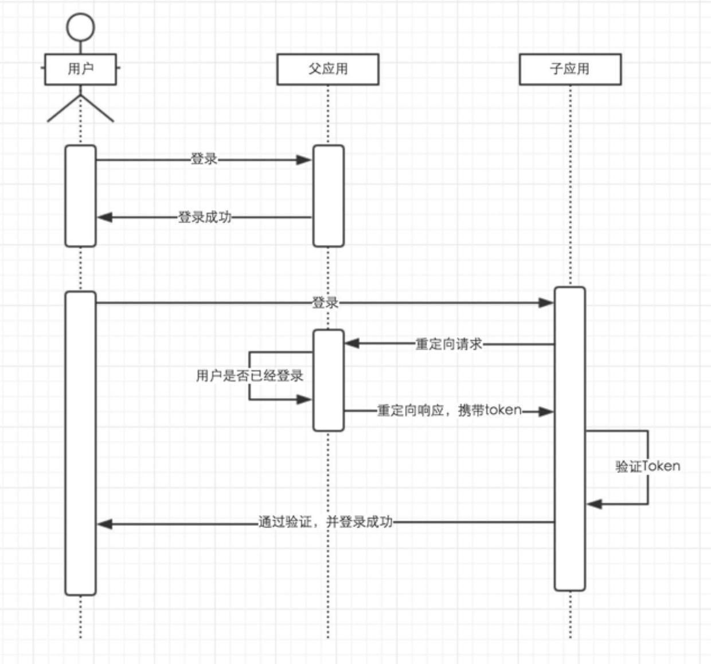

1、 docker 安装 mysql 后，通过 navicat 连接时，出错：2059 - Authentication plugin 'caching_sha2_password' cannot be loaded: dlopen(../Frameworks/caching_sha2_password.so, 2): image not found

**尝试一**：mysql8.0修改了默认的身份验证插件：caching_sha2_password，需要更新下密码算法。

```
mysql> select user,host,authentication_string from mysql.user;
mysql> ALTER user 'root'@'%' IDENTIFIED BY '123456' PASSWORD EXPIRE NEVER;
mysql> ALTER user 'root'@'%' IDENTIFIED WITH mysql_native_password BY '123456';
mysql> FLUSH PRIVILEGES;
```

参考链接：<https://www.jianshu.com/p/0be40c133926>

navicat连接不报错，可建库，但java连接出错。


**解**：使用mariadb

``` bash
docker pull mariadb
docker run --name mariadb -e MYSQL_ROOT_PASSWORD=root -p 3306:3306 -d mariadb
```


2、使用 jmap -heap \<pid> 时，出错：Error attaching to process: sun.jvm.hotspot.debugger.DebuggerException: Can't attach symbolicator to the process

**尝试一**：可能是java进程由root创建，使用su - root后重新运行 jmap \<pid> 。仍然报错


**解**：疑似JDK8 bug，放弃

参考连接：<https://bugs.java.com/bugdatabase/view_bug.do?bug_id=8160743>


发现maven build配置中，java 编译版本为1.7，而我的系统jdk是1.8，可能是这原因。


3、阿里云初始化系统为ubuntu后登陆不上

删除 /Users/qping/.ssh/known_hosts 中之前域名记录。重新 ssh root@blog.qping.me 登陆，使用安装系统盘时设置的密码（通过阿里云的管理界面无法修改密码！）

设置密钥登陆，下次不用再输密码了

```
[root@host ~]$ cd .ssh
[root@host .ssh]$ cat id_rsa.pub >> authorized_keys
```

编辑 /etc屏幕裂了/ssh/sshd_config 文件，进行如下设置：

```
RSAAuthentication yes
PubkeyAuthentication yes
```

另外，请留意 root 用户能否通过 SSH 登录：

```
PermitRootLogin yes
```

当你完成全部设置，并以密钥方式登录成功后，再禁用密码登录：

```
PasswordAuthentication no
```

最后，重启 SSH 服务：

```
[root@host .ssh]$ service sshd restart
```

参考链接：<https://hyjk2000.github.io/2012/03/16/how-to-set-up-ssh-keys/>


4、腾讯云无法用密码登陆

1. 在腾讯云控制台中先重置密码

2. 然后修改 /etc/ssh/sshd_config 中配置：PermitRootLogin without-password  改成PermitRootLogin yes 

3. 然后重启ssh服务 /etc/init.d/ssh restart


5、腾讯云配置免密码登陆不生效

1. 参考阿里云配置免密码登陆

2. 发现是将本地的 ~/.ssh/id_rsa.pub 拷贝到服务器上的 ~/.ssh/authorized_keys 时，少拷贝了一个s

3. 为了避免以后发生类似的问题使用ssh-copy-id来拷贝公钥：

4. ```bash
   ssh-copy-id <username>@<host>
   ```

   

6、springboot启动报错no main manifest attribute, in springboot.jar

pom.xml中没有配置springboot的编译插件或者编译插件放在了\<pluginManagement>标签下.

``` xml
<build>
        <plugins>
            <plugin>
                <groupId>org.springframework.boot</groupId>
                <artifactId>spring-boot-maven-plugin</artifactId>
            </plugin>
            <plugin>
                <groupId>org.apache.maven.plugins</groupId>
                <artifactId>maven-compiler-plugin</artifactId>
                <version>3.6.1</version>
                <configuration>
                    <source>${java.version}</source>
                    <target>${java.version}</target>
                    <encoding>${compiler-encoding}</encoding>
                </configuration>
            </plugin>
        </plugins>
    </build>
```

可以查看编译后的jar包中 META-INF/MANIFEST.MF 文件，有 Start-Class 代表编译正确。

```
Manifest-Version: 1.0
Implementation-Title: service-cdc
Implementation-Version: 0.0.1-SNAPSHOT
Built-By: qping
Implementation-Vendor-Id: com.rxthinking.appservice
Spring-Boot-Version: 2.0.2.RELEASE
Main-Class: org.springframework.boot.loader.JarLauncher
Start-Class: com.rxthinking.cdc.App
Spring-Boot-Classes: BOOT-INF/classes/
Spring-Boot-Lib: BOOT-INF/lib/
Created-By: Apache Maven 3.5.3
Build-Jdk: 1.8.0_171
Implementation-URL: https://projects.spring.io/spring-boot/#/spring-bo
 ot-starter-parent/app-service/service-cdc
```


7、docker:build 时报错 No plugin found for prefix 'docker' in the current project and in the plugin groups

在maven的setting.xml中加入

```xml
<pluginGroups>  
    <pluginGroup>com.spotify</pluginGroup>  
</pluginGroups>
```


8、使用docker-maven-plugin编译时报错： Exception caught: Must specify baseImage if dockerDirectory is null

在configuration中增加resources，指定build的上下文

```
<configuration>
    <imageName>docker.qping.me:5000/blog:v2.1</imageName>
    <dockerDirectory>${basedir}/docker</dockerDirectory> <!-- 指定 Dockerfile 路径-->
    <resources>
        <resource>
            <targetPath>/</targetPath>
            <directory>${project.build.directory}</directory>
            <include>${project.build.finalName}.jar</include>
        </resource>
    </resources>
</configuration>
```

将Dockerfile中 `ADD target/service-blog-*.jar springboot.jar` 改为` ADD service-blog-*.jar springboot.jar`


9、如何执行 docker-maven-plugin

在 docker-maven-plugin 插件中加入

```
<executions>
    <execution>
        <phase>package</phase>
        <goals>
            <goal>build</goal>
        </goals>
    </execution>
</executions>
```

然后执行 mvn package即可（在执行完package后maven会调用docker插件打包镜像）


10、如何在docker 容器中设置环境变量

docker run -e ENV_PASSWORD=123456 ....


11、如何在springboot的yml中使用环境变量

```
datasource:
  username: root
  password: ${ENV_PASSWORD}
```

环境变量没有值可以配置个默认的参数，冒号后跟默认的值，${ENV_PASSWORD:123456}

启动后发现无法获取，经查是intellij中启动的程序无法使用系统中的环境变量，可在启动配置中设置environment variables


12、springboot package的时候 application.yml 不被拷贝到target目录下

resources目录名写错了，少了个s


13、如何在springboot中区分线上和开发环境

定义多个application-*.yml

```
application.yml
application-dev.yml
application-prod.yml
applicaiton-common.yml
```

使用jar启动时增加profile配置：

```
java -jar app.jar --spring.profiles.active=common,prod
```

在application.yml中配置默认开发环境：

```
spring:
	profiles:
		active: dev,common
```


14、docker使用network参数来进行容器间通信时报错：docker: Error response from daemon: network share-network not found.

需要先创建网络：

```
docker create network share-network
```

然后再使用网络启动

```
docker run --network=share-network test-app
```


15、Intellij中报错：Library Maven: org.freemarker:freemarker:2.3.28 has broken classes path:

intellij perference > Build Tools > Maven > User settings file 和 Local  repository 重新换个目录即可。


16、使用vue.js时正常，vue.min.js时报错：vue.min.js:6 ReferenceError: redirectTo is not defined

mehods中没有定义方法：redirectTo


17、Vue中使用自定义组件时报错 [Vue warn]: Unknown custom element: \<commenttree> - did you register the component correctly? For recursive components, make sure to provide the "name" option.

component的id定义为：CommentTree，需要改成全小写，不能用驼峰

```
Vue.component("CommentTree", {
...
})

```


18、Vue中在组件中使用this.$emit()调用父控件的方法时，不成功。控制台信息：[Vue tip]: Event "replyclick" is emitted in component \<CommentTree> but the handler is registered for "replyClick". Note that HTML attributes are case-insensitive and you cannot use v-on to listen to camelCase events when using in-DOM templates. You should probably use "reply-click" instead of "replyClick".

方法名 replyClick 改为 reply-click 即可，不能有大写。


19、Mqconf中配置完队列和exchange，rabbitmq中Queues和Exchanges查询不到

没有配置 @RabbitListener 的 handler


20、Springboot项目新建完毕后启动就停止

没有配置 @RabbitListener 的 handler


21、Intellij 报错：Module "service-his-interface" must not contain source root "~/service-his-interface/src/main/java" The root already belongs to module "service-system"

观察发现service-system模块中java目录备注显示为service-his-interface，而service-his-interface模块中java目录备注显示为 service-system。怀疑为两个工程配置串了。


打开 Project Structure > Modules 在 service-his-interface中出现了service-system的content目录，删掉即可。


22、Intellij中切换分支后，右侧Maven Projects中项目重复出现两个的问题。


猜测是因为切换分支后，另一个分支中没有 Module，在切回来会有缓存

File > New > Projects from Exists Sources


23、Java:找不到符号，lombok @Data注释不生效的问题

Intellij中打开设置界面 Build,Execution,Deployment > Complier > Annotation Processors > Enable annotation processing 勾选上。

参考链接：https://blog.csdn.net/m0_37779977/article/details/79028299


第二种情况:

pom.xml中多了 `<proc>none</proc>` 后会报这个错误,删除就可以通过编译

```
<plugin>
    <groupId>org.apache.maven.plugins</groupId>
    <artifactId>maven-compiler-plugin</artifactId>
    <version>3.6.1</version>
    <configuration>
        <proc>none</proc>
        <source>${java.version}</source>
        <target>${java.version}</target>
        <encoding>${compiler-encoding}</encoding>
    </configuration>
</plugin>
```


24、postman runner跑脚本时发现修改的User-Agent不生效

post版本为6.7.2 Mac App，最后发现是没有保存，Ctrl+S后就生效了


25、如何切换kubernetes的context

 kubectl config use-context yuhuatai-context


26、如何设置kubernetes默认的namespace

kubectl config set-context $(kubectl config current-context) --namespace=service-nj


27、git.bdmd.com代码无法提交，重启vpn也没用

重启电脑


28、src/main/docker/env/ 目录下的内容无法使用 git 提交

去掉 .gitignore 里面的 env/ 那一行


29、CentOS一键安装shadowsocks脚本

```
wget --no-check-certificate https://raw.githubusercontent.com/teddysun/shadowsocks_install/master/shadowsocks.sh
chmod +x shadowsocks.sh
./shadowsocks.sh 2>&1 | tee shadowsocks.log
```


30、Centos安装docker

安装依赖包

```bash
$ sudo yum install -y yum-utils \
           device-mapper-persistent-data \
           lvm2
```

执行下面的命令添加 `yum` 软件源：

```bash
$ sudo yum-config-manager \
    --add-repo \
    https://mirrors.ustc.edu.cn/docker-ce/linux/centos/docker-ce.repo


# 官方源
# $ sudo yum-config-manager \
#     --add-repo \
#     https://download.docker.com/linux/centos/docker-ce.repo
```

更新 `yum` 软件源缓存，并安装 `docker-ce`。

```bash
$ sudo yum makecache fast
$ sudo yum install docker-ce
```

启动docker

```bash
$ sudo systemctl enable docker
$ sudo systemctl start docker
```


31、springboot 启动时 --spring.profiles.active=dev 不起作用

SpringApplication run 没有传入args参数

```
public class App {
    public static void main( String[] args ) {
        SpringApplication.run(App.class);
    }
}
```

改为

```
public class App {
    public static void main( String[] args ) {
        SpringApplication.run(App.class, args);
    }
}
```


32、macos 系统中 teamviewer 被识别为商业用途，如何修改teamview id？

执行下面的 python 脚本，修改mac地址

```python
#!/usr/bin/env python 

#coding:utf-8
import sys
import os
import glob
import platform
import re
import random
import string

print('''
--------------------------------
TeamViewer ID Changer for MAC OS
--------------------------------
''')

if platform.system() != 'Darwin':
    print('This script can be run only on MAC OS.')
    sys.exit();

if os.geteuid() != 0:
    print('This script must be run form root.')
    sys.exit();

if os.environ.has_key('SUDO_USER'):
    USERNAME = os.environ['SUDO_USER']
    if USERNAME == 'root':
       print('Can not find user name. Run this script via sudo from regular user')
       sys.exit();
else:
    print('Can not find user name. Run this script via sudo from regular user')
    sys.exit();

HOMEDIRLIB = '/Users/' + USERNAME  + '/library/preferences/'
GLOBALLIB  =  '/library/preferences/'

CONFIGS = []

# Find config files

def listdir_fullpath(d):
    return [os.path.join(d, f) for f in os.listdir(d)]

for file in listdir_fullpath(HOMEDIRLIB):
    if 'teamviewer'.lower() in file.lower():
        CONFIGS.append(file)

if not CONFIGS:
    print ('''
There is no TemViewer configs found.
Maybe you have deleted it manualy or never run TeamViewer after installation.
Nothing to delete.
''')
# Delete config files
else:
    print("Configs found:\n")
    for file in CONFIGS:
        print file

    print('''
This files will be DELETED permanently.
All TeamViewer settings will be lost
''')
    raw_input("Press Enter to continue or CTR+C to abort...")

    for file in CONFIGS:
        try:
            os.remove(file)
        except:
            print("Cannot delete config files. Permission denied?")
            sys.exit();
    print("Done.")

# Find binaryes

TMBINARYES = [
'/Applications/TeamViewer.app/Contents/MacOS/TeamViewer',
'/Applications/TeamViewer.app/Contents/MacOS/TeamViewer_Service',
'/Applications/TeamViewer.app/Contents/Helpers/TeamViewer_Desktop',
]

for file in TMBINARYES:
    if os.path.exists(file):
        pass
    else:
        print("File not found: " + file)
        print ("Install TeamViewer correctly")
        sys.exit();

# Patch files

def idpatch(fpath,platf,serial):
    file = open(fpath, 'r+b')
    binary = file.read()
    PlatformPattern = "IOPlatformExpert.{6}"
    SerialPattern =  "IOPlatformSerialNumber%s%s%sUUID"

    binary = re.sub(PlatformPattern, platf, binary)
    binary = re.sub(SerialPattern % (chr(0), "[0-9a-zA-Z]{8,8}", chr(0)), SerialPattern%(chr(0), serial, chr(0)), binary)

    file = open(fpath,'wb').write(binary)
    return True

def random_generator(size=8, chars=string.ascii_uppercase + string.digits):
    return ''.join(random.choice(chars) for _ in range(size))

RANDOMSERIAL = random_generator()
RANDOMPLATFORM = "IOPlatformExpert" + random_generator(6)


for file in TMBINARYES:
        try:
            idpatch(file,RANDOMPLATFORM,RANDOMSERIAL)
        except:
            print "Error: can not patch file " + file
            print "Wrong version?"
            sys.exit();

print "PlatformDevice: " + RANDOMPLATFORM
print "PlatformSerial: " + RANDOMSERIAL

print('''
ID changed sucessfully.
!!! Restart computer before using TeamViewer !!!!
''')
```


33、kubectl 拷贝文件到容器内

```
kubectl cp <some-namespace>/<some-pod>:/tmp/foo /tmp/bar
```


34、linux 如何删除（杀掉）所有 java 进程

```
ps -ef | grep java | grep -v grep | awk '{print $2}' | xargs kill -9
```


35、单点登录实现

1、基于cookie，不能实现跨域，cookie泄漏有安全性问题


2、给予cookie和jsonp，支持跨域，同样有安全性问题


3、通过页面重定向实现



https://blog.csdn.net/qq_39089301/article/details/80615348


36、在bash_profile中配置环境变量后不生效，需要每次source后才起作用

因为我使用的是 zsh，打开控制台时时不执行 ~/.bash_profile 的，如果想要这个文件生效，那么修改zsh的配置文件。编辑 ~/.zshrc，在文件中加入一行：

```
source ~/.bash_profile
```


37、intellij中控制台mvn spring-boot:run无法启动，无法找到环境变量

参考36后，执行source ~/.bash_profile 或者重启intellij 生效


38、intellij中启动springboot失败，没有错误日志

mvn spring-boot:run 可以看到具体的错误日志


39、怎么切换bash为zsh

```
chsh -s /bin/zsh
```

切换回bash

```
chsh -s /bin/bash
```

查询本机安装了哪些shell

```
cat /etc/shells
```


40、centos 关机

```
shutdown -r now 
```


41、vmware fusion 使用

设置共享文件夹： https://blog.csdn.net/yangcs2009/article/details/46625377

安装 vmware tools： https://blog.51cto.com/tenderrain/2090619


42、rpm 安装、查看与删除

```
# 安装
rpm -ivh test.rpm
# 查询
rpm -qa|grep test
# 删除
rpm -e test --nodeps
```


43、linux 解压 tar.gz 文件

```
tar -xvf file.tar 		//解压 tar包
tar -xzvf file.tar.gz 	//解压tar.gz
tar -xjvf file.tar.bz2  //解压 tar.bz2
tar -xZvf file.tar.Z	//解压tar.Z
unrar e file.rar		//解压rar
unzip file.zip			//解压zip
```


44、docker toolbox 配置共享文件夹

```
sudo -i
mount -t vboxsf Desktop /data  #前者是共享文件夹名 ，后面是宿主机上的映射目录名
```

经验证：不需要执行命令，docker-machine ssh后直接可以看到 /data目录

https://blog.csdn.net/malcody9/article/details/79315700


45、centos安装后无网络连接，ip addr后 enp2s0无ip地址

```
cd /etc/sysconfig/network-scripts
vi ifcfg-enp2s0
```

将 ONBOOT=no 改为 ONBOOT=yes，重启centos

https://www.jb51.net/article/98539.htm


46、docker 容器内安装 ps 、 ping、wget

apt-get install -y procps inetutils-ping wget


47、centos 挂载ntfs

下载安装包 <http://linux.softpedia.com/get/System/Hardware/ntfs-3g-15028.shtml>

```
tar xzvf ntfs-3g-***.tar.gz
cd ntfs-3g-***
./configure
make
make install
mount -t ntfs-3g /dev/sdc1 /mnt
```


48、centos配置固定IP

注解

```
IPADDR=192.168.191.131 # ip地址
NETMASK=255.255.255.0 # 子网掩码
NETWORK=192.168.191.0 # ip段
GATEWAY=192.168.191.2 # 网关地址
BROADCAST=192.168.191.255 # 广播地址, 网关地址最后一位换成255

service network restart
```

实际例子

```
TYPE=Ethernet
PROXY_METHOD=none
BROWSER_ONLY=no
DEFROUTE=yes
IPV4_FAILURE_FATAL=no
IPV6INIT=yes
IPV6_AUTOCONF=yes
IPV6_DEFROUTE=yes
IPV6_FALURE_FATAL=no
IPV6_ADDR_GEN_MODE=stable-privacy
NAME=enp2s0
UUID=877....
DEVICE=enp2s0
ONBOOT=yes
IPV6_PRIVACY=no
PREFIX=24
GATEWAY=192.101.1.1
IPADDR=192.101.1.198
```

49、centos桌面版本关闭休眠

因为X的屏幕保护，[电源管理](https://www.baidu.com/s?wd=%E7%94%B5%E6%BA%90%E7%AE%A1%E7%90%86&tn=24004469_oem_dg&rsv_dl=gh_pl_sl_csd)机制跟gnome不一样。所以无法使用对gnome的一套工具进行设置。
所幸发现了名为xset的小工具

xset程序主要对启动X windows以后，对x windows属性进行设置的。
具体用法可使用 man xset进行查看。此处不再描述。

可以使用xset命令设置各项：

```
#xset s 300      # 设置屏保时间为 300 秒，时间单位为秒
#xset s 0        # 关闭屏幕保护 
#xset dpms 0 0 0 # 三个数值分别为Standby、Suspend、Off，单位秒
#xset -dpms      # 关闭电源管理
```

也可以编辑xorg.conf，添加如下选项把xscreen saver直接关闭，vim /etc/X11/xorg.conf：

```
Section “ServerFlags” 
Option “BlankTime” “0″ #关闭黑屏
Option “StandbyTime” “0″ #关闭待机功能
Option “SuspendTime” “0″ #关闭睡眠功能
Option “OffTime” “0″ EndSection
```

修改后重启x即可生效。 

编辑xorg.conf文件和使用xset命令效果一样，可使用xset -q查看设置和当前配置。

 

备注：

时间值设置成0 就是关闭该项.
更多配置请看：http://www.x.org/archive/X11R6.9.0/doc/html/xorg.conf.5.html并查找“ServerFlags”。


50、docker 批量操作

批量删除 tag为none的镜像

```
docker images|grep none|awk '{print $3}'|xargs docker rmi
```

批量push

```
docker images | grep njwjw-1.0 | awk '{print "docker push "$1":"$2}' | sh
```

批量apply

```
ls -l | awk '{if($9)print "kubectl apply -f "$9" --record"}' | sh
```


51、mongodb 拷贝数据

```
db.copyDatabase('dataplatform','dataplatform','192.168.50.6:27017',null)


cd /data/mongodb/
tar -zcvf all.tar.gz *
scp liang@192.168.60.34:/data/mongodb/all.tar.gz /Users/qping/Downloads

```


52、Centos (linux) 增加root权限用户

```
useradd -m qping
passwd qping
```

增加用户后，使用 `visudo` 来修改sudoers文件，在以下文件添加一行 

```
## Allow root to run any commands anywhere
root    ALL=(ALL)       ALL
qping   ALL=(ALL)       ALL   # <~ 添加这个
```


53、 mongodb导入导出数据

参见 <https://segmentfault.com/a/1190000006236494>

先本地安装mongodb，因为需要使用到 **mongodump**、**mongorestore** 两个工具

```
brew install mongodb
```

导出和导入命令

```
# 整库导出和导入
mongodump -h IP --port 端口 -u 用户名 -p 密码 -d 数据库 -o 文件存在路径
mongorestore -h IP --port 端口 -u 用户名 -p 密码 -d 数据库 --drop 文件存在路径

# 导出单张表
mongoexport -h IP --port 端口 -u 用户名 -p 密码 -d 数据库 -c 表名 -f 字段
mongoimport -h IP --port 端口 -u 用户名 -p 密码 -d 数据库 -c 表名 --upsert --drop 文件名
```

实际使用

```
# 导出
mongoexport -h kube0.dev-bdmd.com --port 27017 -d dataplatform -c entity.disease.document -o ~/Documents/mongodb/disease.dat

mongoexport -h kube0.dev-bdmd.com --port 27017 -d dataplatform -c entity.disease.wiki.document -o ~/Documents/mongodb/disease.wiki.dat

mongoexport -h kube0.dev-bdmd.com --port 27017 -d dataplatform -c entity.drug.document -o ~/Documents/mongodb/drug.dat

mongoexport -h kube0.dev-bdmd.com --port 27017 -d dataplatform -c entity.labitem.document -o ~/Documents/mongodb/labitem.dat

mongoexport -h kube0.dev-bdmd.com --port 27017 -d dataplatform -c entity.symptom.document -o ~/Documents/mongodb/symptom.dat


# 导入
mongoimport -h 192.168.60.34 --port 57017 -d dataplatform -c entity.disease.document  --upsert --drop ~/Documents/mongodb/disease.dat

mongoimport -h 192.168.60.34 --port 57017 -d dataplatform -c entity.disease.wiki.document  --upsert --drop ~/Documents/mongodb/disease.wiki.dat

mongoimport -h 192.168.60.34 --port 57017 -d dataplatform -c entity.drug.document  --upsert --drop ~/Documents/mongodb/drug.dat

mongoimport -h 192.168.60.34 --port 57017 -d dataplatform -c entity.labitem.document  --upsert --drop ~/Documents/mongodb/labitem.dat

mongoimport -h 192.168.60.34 --port 57017 -d dataplatform -c entity.symptom.document  --upsert --drop ~/Documents/mongodb/symptom.dat

# 出现错误： Failed: error connecting to db server: no reachable servers
上一个导入成功了，在导入symptom时出错，错误原因是没有建立 entity.symptom.document 集合，新建后，重新导入即可

```


54、zsh配置命令别名，简化shell命令

vi ~/.zshrc，增加命令别名

```
# alias
alias kubedev='kubectl --kubeconfig /Users/qping/.kube/config --context dev-context' 
alias kubenj='kubectl --kubeconfig /Users/qping/.kube/config --context njwjw' 
alias kubeyh='kubectl --kubeconfig /Users/qping/.kube/config --context yuhuatai-context' 
```


55、spring jpa保存后没有返回id

需要加上注解 @GeneratedValue

```
  @Id
  @Column(name = "id")
  @GeneratedValue(strategy = GenerationType.IDENTITY)
  private int id;
```


56、org.springframework.http.converter.HttpMessageNotReadableException: Required request body is missing

后台方法是这样的，debug请求发现 RequestBody中是有 token 的，但是还是报错  Required request body is missing

```java

@PostMapping(value = "/getUserByToken" , produces = "application/json")
public ApiResult getUserByToken(@ApiParam(value = "token令牌") @RequestBody TokenWrapper tokenWrapper) throws Exception {
	SessionUserVO user = userService.getUserByToken(tokenWrapper.getToken());
  if(user == null){
    return new ApiResult(ApiResult.TOKEN_ERR, "token无效", null);
  }
  return new ApiResult(ApiResult.SUCCESS, "成功", user);
}
```


发现定义了 拦截器 Interceptor，拦截器中读取 request 的 inputstream 流，读取完后，后面的 Controller 无法通过  @RequestBody 的方式获取传值。

```
byte[] bytes = IOUtils.toByteArray(request.getInputStream());
String params = new String(bytes, request.getCharacterEncoding());
request.setAttribute("param", params);
```

解决方法：通过 request.getAttribute("param") 来获取


57、docker 运行sqlserver

创建容器

```
docker run -e 'ACCEPT_EULA=Y' -e 'SA_PASSWORD=P@ssw0rd' \
   -p 1433:1433 --name sqlserver \
   -d mcr.microsoft.com/mssql/server:2017-latest
```

创建 Database

```
docker exec -it sqlserver "bash"
/opt/mssql-tools/bin/sqlcmd -S localhost -U SA -P 'P@ssw0rd'
```

屏幕出现 `> 1` 后输入：

```
CREATE DATABASE TestDB COLLATE Chinese_PRC_CS_AS
GO
```


58、Unable to connect to the server: dial tcp 192.168.60.28:6443: getsockopt: operation timed out

kubectl get pod时出现超时错误，解决方法，重启公司VPN


59、windows R语言安装 xlsx 时出错：JAVA_HOME cannot be determined from the Registry!

执行命令：`install.packages("xlsx")` ，详细错误信息如下，系统为windows，已设置过环境变量 JAVA_HOME 、CLASSPATH 和 PATH

```
Error : loadNamespace()里算'rJava'时.onLoad失败了，详细内容：
调用: fun(libname, pkgname)
错误: JAVA_HOME cannot be determined from the Registry! Try re-installing Java and make sure R and Java have matching architectures.
Error: ‘rJava’程辑包或名字空间载入失败
```

Sys.getenv("JAVA_HOME") 发现 R 读取不到系统环境变量。

解决方法：Sys.setenv(JAVA_HOME="jre的路径")


继续执行命令：`install.packages("xlsx")`  ，又报错：

```
error: 无法载入共享目标对象‘C:/Users/Administrator/Documents/R/win-library/3.3/rJava/libs/i386/rJava.dll’
```

解决方法是：Jdk版本需要和 R 语言版本一致，**且 R 语言 32 位和 64 位版本不能同时安装**。


60、macos R语言安装 xlsx 时出错：package or namespace load failed for ‘xlsx’

```
错误: package or namespace load failed for ‘xlsx’:
 loadNamespace()里算'rJava'时.onLoad失败了，详细内容：
  调用: dyn.load(file, DLLpath = DLLpath, ...)
  错误: 无法载入共享目标对象‘/Library/Frameworks/R.framework/Versions/3.5/Resources/library/rJava/libs/rJava.so’：:
  dlopen(/Library/Frameworks/R.framework/Versions/3.5/Resources/library/rJava/libs/rJava.so, 6): Library not loaded: /Library/Java/JavaVirtualMachines/jdk-11.0.1.jdk/Contents/Home/lib/server/libjvm.dylib
  Referenced from: /Library/Frameworks/R.framework/Versions/3.5/Resources/library/rJava/libs/rJava.so
  Reason: image not found
```


解决方法：https://blog.csdn.net/weixin_38986122/article/details/80931223


61、R 语言安装 forecast 失败：namespace 'rlang' 0.2.0 is being loaded, but >= 0.2.1 is required

```
> install.packages("forecast")

....
  有二进制版本的，但源代码版本是后来的:
         binary source needs_compilation
rlang     0.2.0  0.3.4              TRUE
ggplot2   2.2.1  3.1.1             FALSE
forecast    8.2    8.7              TRUE

....

* installing *source* package 'ggplot2' ...
** 成功将'ggplot2'程序包解包并MD5和检查
** R
** data
*** moving datasets to lazyload DB
** inst
** preparing package for lazy loading
Error in loadNamespace(j <- i[[1L]], c(lib.loc, .libPaths()), versionCheck = vI[[j]]) : 
  namespace 'rlang' 0.2.0 is being loaded, but >= 0.2.1 is required
ERROR: lazy loading failed for package 'ggplot2'
* removing 'C:/Users/Administrator/Documents/R/win-library/3.3/ggplot2'

```


解决方法：升级 R 语言至最新版本


62、Rserve 启动报错：Fatal error: you must specify '--save', '--no-save' or '--vanilla'

解决方法：Rserve(port=6311, args="--no-save")

https://github.com/clbustos/Rserve-Ruby-client/issues/19


63、解决macos系统下“无效的服务器地址 BasicIPv6ValidationError”，ipaddr设置

在mac系统下(os x 10),手动设置ip地址后，弹出错误提示“无效的服务器地址 BasicIPv6ValidationError”
 解决的办法是:

```
// 列出所有网络服务信息;
networksetup -listallnetworkservices
// 停止对应网卡的ipV6服务;
networksetup -setv6off "USB Ethernet" 
// 手动设置网卡的ip地址;
networksetup -setmanual "USB Ethernet" 192.168.1.177 255.255.255.0 192.168.1.1

```


链接：https://www.jianshu.com/p/e07d2ecfa3b2


64、R语言安装程序包出错：package ‘fUnitRoots’ is not available (for R version 3.6.0) 

urca / fUnitRoots /  FinTS / fGarch / nlme / fArma 这几个都安装不了，网上解决方案是更换镜像源，但实际遇到的问题是windows版本太新安装失败，需要降低版本到3.5.2


：


65、intellij idea build 不生成class，报错找不到jar包，通过maven build却可以生成class

原因：intellij 配置出现混乱，apps中 Sources 引用子模块 service-book 中的路径，导致 service-book 无法编译


66、mysql 授权

```
GRANT ALL PRIVILEGES ON *.* TO 'datamiller'@'%' IDENTIFIED BY 'datamiller' WITH GRANT OPTION;   
FLUSH   PRIVILEGES; 
```


67、sublime 删除包含某个关键字的行

选中该关键字-->Ctrl + CMD + G (Quick find all)-->CMD + L (Expand selection to line)-->按下Delete键删除即可


68、iTerms 设置快捷键使用左右箭头在单词之间移动

Preferences → Profiles → Key Mappings

```
选择 Action 为 `Send Escape Sequence`
将 `⌥→` 的 Esc+ 里填 `f`
将 `⌥←` 的 Esc+ 里填 `b`
```

https://www.jianshu.com/p/c0816fa6ac1b


69、kubectl 错误  exec: "bash": executable file not found in $PATH

```
rpc error: code = 2 desc = oci runtime error: exec failed: exec: "bash": executable file not found in $PATH
error: error executing remote command: error executing command in container: Error executing in Docker Container: 126
```

使用： kubectl exec -it XXXXX sh


70、word表格拷贝到excel，合并单元格

如果word中的单元格内容含有换行，在excel中就会变为多个单元格，如果只想一个单元格，就需要替换换行。

硬回车：`^p`  ，软回车： `^l` ，`ctrl + H` 替换。


71、[SpringBoot配置devtools实现热部署](https://www.cnblogs.com/lspz/p/6832358.html)

spring为开发者提供了一个名为spring-boot-devtools的模块来使Spring Boot应用支持热部署，提高开发者的开发效率，无需手动重启Spring Boot应用。

**devtools的原理**

深层原理是使用了两个ClassLoader，一个Classloader加载那些不会改变的类（第三方Jar包），另一个ClassLoader加载会更改的类，称为restart ClassLoader,这样在有代码更改的时候，原来的restart ClassLoader 被丢弃，重新创建一个restart ClassLoader，由于需要加载的类相比较少，所以实现了较快的重启时间。

使用需要添加以下的配置：

```
<dependencies>
    <dependency>
        <groupId>org.springframework.boot</groupId>
        <artifactId>spring-boot-devtools</artifactId>
        <optional>true</optional>
    </dependency>
    <dependency>
        <groupId>org.springframework.boot</groupId>
        <artifactId>spring-boot-starter-web</artifactId>
    </dependency>

    <dependency>
        <groupId>org.springframework.boot</groupId>
        <artifactId>spring-boot-starter-test</artifactId>
        <scope>test</scope>
    </dependency>
</dependencies>

<build>
    <plugins>
        <plugin>
            <groupId>org.springframework.boot</groupId>
            <artifactId>spring-boot-maven-plugin</artifactId>
            <configuration>
                <fork>true</fork>
            </configuration>
        </plugin>
    </plugins>
</build>
```

**说明：**

（1） devtools可以实现页面热部署（即页面修改后会立即生效，这个可以直接在application.properties文件中配置spring.thymeleaf.cache=false来实现），
实现类文件热部署（类文件修改后不会立即生效），实现对属性文件的热部署。
即devtools会监听classpath下的文件变动，并且会立即重启应用（发生在保存时机），注意：因为其采用的虚拟机机制，该项重启是很快的
（2）配置了true后在修改java文件后也就支持了热启动，不过这种方式是属于项目重启（速度比较快的项目重启），会清空session中的值，也就是如果有用户登陆的话，项目重启后需要重新登陆。

默认情况下，/META-INF/maven，/META-INF/resources，/resources，/static，/templates，/public这些文件夹下的文件修改不会使应用重启，但是会重新加载（devtools内嵌了一个LiveReload server，当资源发生改变时，浏览器刷新）。

**devtools的配置**

在application.properties中配置spring.devtools.restart.enabled=false，此时restart类加载器还会初始化，但不会监视文件更新。
在SprintApplication.run之前调用System.setProperty(“spring.devtools.restart.enabled”, “false”);可以完全关闭重启支持，配置内容：

```
#热部署生效
spring.devtools.restart.enabled: true
#设置重启的目录
#spring.devtools.restart.additional-paths: src/main/java
#classpath目录下的WEB-INF文件夹内容修改不重启
spring.devtools.restart.exclude: WEB-INF/**
```

**IDEA配置**

当我们修改了Java类后，IDEA默认是不自动编译的，而spring-boot-devtools又是监测classpath下的文件发生变化才会重启应用，所以需要设置IDEA的自动编译：

（1）File-Settings-Compiler-Build Project automatically

（2）ctrl + shift + alt + /,选择Registry,勾上 Compiler autoMake allow when app running

**测试**

- 修改类–>保存：应用会重启
- 修改配置文件–>保存：应用会重启
- 修改页面–>保存：应用不会重启，但会重新加载，页面会刷新（原理是将spring.thymeleaf.cache设为false，参考:Spring Boot配置模板引擎）


72、热部署神器 jrebel 的安装与激活

离线激活方式： https://blog.csdn.net/lwl20140904/article/details/81071305

在线激活方式：https://blog.csdn.net/qq_31024823/article/details/82020791

1、打开激活代理，反向代理 idea.lanyus.com

```
docker run --name proxy -d -p 9999:80 vpn.qping.me/jrebel-proxy:v1.0
```

2、在idea > plugins > 安装 jrebel

3、激活

选择Team URL：

第一行填入： 激活代理地址 + UUID，例如：http://localhost:9999/ee19a6eb-1a65-41eb-962b-7bd5a32f9945

第二行填入：自己的邮箱


4、在idea > settings > JRebel 中 点击 Work offline


73、git 添加gitignore文件后使其生效

遇到的问题
我们发现在添加.gitignore文件后，当我们想push文件的时候，我们声明的忽略文件还是会出现在push的目录中

原因分析
某些文件已经被纳入版本管理中，就算是在.gitignore中已经声明也不会起作用

解决方案
我们应该先把本地的缓存删除，然后再进行push，操作步骤如下

```none
git rm -r --cached . // 删除本地缓存
git add . // 添加要提交的文件
git commit -m 'update .gitignore' // 更新本地的缓存
```


74、自己打包的jar，依赖没有传递

原因：使用了 scope=system 引起


75、阿里云SSH几分钟就会断开解决方法

vim 修改 ssh 的配置文件

``` shell
/etc/ssh/sshd_config
```

找到下面两行

``` shell
#ClientAliveInterval 0
#ClientAliveCountMax 3
```

去掉注释，改成

``` shell
ClientAliveInterval 30
ClientAliveCountMax 86400
```

这两行的意思分别是

1、客户端每隔多少秒向服务发送一个心跳数据

2、客户端多少秒没有相应，服务器自动断掉连接

重启sshd服务

``` shell
service sshd restart
```