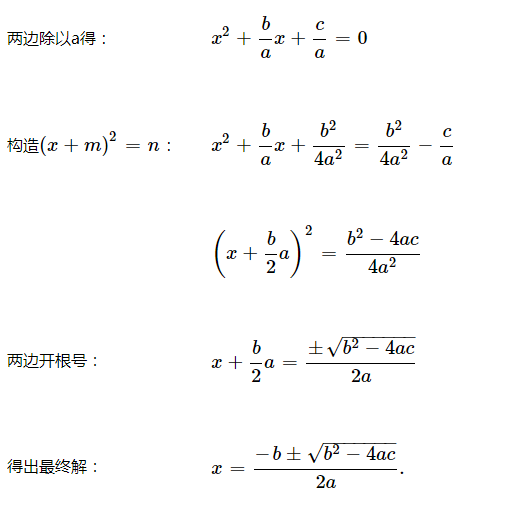

正在学python，主要在看廖雪峰的python教程，讲到函数定义的时候，有道课外习题：求ax2+bx+c=0的解，折腾了下还是写出来了，把过程记录一下。

<!-- more -->


# 1、 公式推导




# 2、 python实现

```
import math

def quadratic(a, b, c):
    if a == 0 and b == 0 and c != 0:
        return "此方程无解"
    if a == 0 and b == 0 and c == 0:
        return 'x为任意值'
    if a == 0 and b != 0:
        return c / b

    x1 = (-b + math.sqrt(b * b - 4 * a * c)) / (2 * a)
    x2 = (-b - math.sqrt(b * b - 4 * a * c)) / (2 * a)

    if x1 == x2:
        return "x为%s" % x1
    else:
        return "x为%s或者%s" % (x1, x2)
```


# 3、参考

[廖雪峰的python教程](https://www.liaoxuefeng.com/wiki/0014316089557264a6b348958f449949df42a6d3a2e542c000/001431679203477b5b364aeba8c4e05a9bd4ec1b32911e2000)