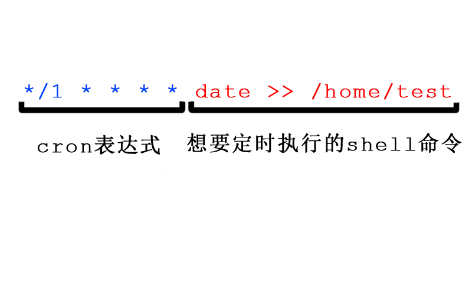

好久不登博客，发现SSL证书过期了，chrome又开始提示网站不安全，查了下可以使用certbot-auto来更新证书，然后再建立一个定时任务就可以不用手动更新了。

<!-- more -->

# 一、如何建立一个定时任务

1. 新建文件cron_task
​    输入：*/1 * * * * date >> /home/test
​    保存：wq
1. 设置定时任务：crontab cron_task
1. 查看是否成功：crontab -l
1. 删除定时任务：crontab -r
1. 直接编辑当前用户的crontab: crontab -e



# 二、cron表达式

一共5个位置，每个位置分别代表：分、时、日、月、星期。crontab是每分钟去检查一次，最小间隔是分钟。

每个位置可以填的合法字符，除了数字，还有"*"、"/"、"-"、","。

1. "*"代表：所有的取值范围内的数字
2. "/"代表：每的意思，*/5 * * * * 就是从第0分钟开始每5分钟执行一次
3. "-"代表：从某个数字到某个数字
4. ","代表：分开几个离散的数字

举例：

1. 0 6 * * *       （每天早上6点执行一次）
2. 0 */2 * * *     （每2小时执行一次）
3. 0 1,2,3 * * *    (每天早上1点、2点、3点各执行一次）
4. 0 1-6/2 * * *    (每天1点到6点之间，每两小时执行一次）


# 三、定时任务更新SSL证书

每个月强制更新一次证书： 

```
0 0 1 * * /bin/bash /root/certbot-auto renew
```


# 四、错误解决

执行指令的时候报错：

``` bash
Attempting to renew cert (blog.qping.me) from /etc/letsencrypt/renewal/blog.qping.me.conf produced an unexpected error: 'ascii' codec can't decode byte 0xe5 in position 1530: ordinal not in range(128). Skipping.
All renewal attempts failed. The following certs could not be renewed:
/etc/letsencrypt/live/blog.qping.me/fullchain.pem (failure)
```

解决方式：

发现在nginx.conf中中文出现乱码了，删除配置中的中文和乱码后，再执行一次就ok。