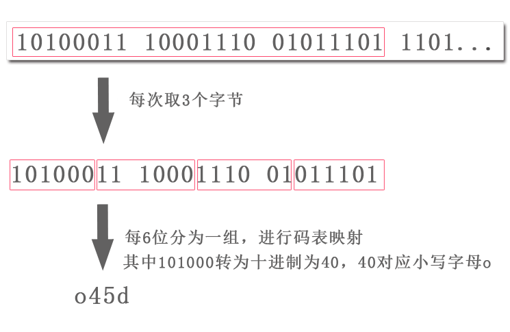

base64 是用 64 个 ASCII 字符对数据进行编码的方法。某些系统或者软件展示不了非 ASCII 字符，使用 base64 编码后数据变为 ASCII 字符，可读可见，使用中不容易出错。应用场景如 HTML 中可以写入 base64 编码后的图片数据，证书一般也是用 base64 编码后供人下载使用。

<!-- more -->

# 1、编码原理

将数据每 3 个字节为一组进行编码，每组分为 4 份  （即每份 6bit），通过码表转化为对应的 ASCII 字符。如果编码时字节数不满 3 个，末尾补零补齐到 6bit，剩下的几份转化为 `=`，如只有 1 个字节时，第一份正常操作，第二份末尾补零至 6 位，第三、四份转码为`=`。base64 的码表你也可以自定义，不过一般没有必要。编码后 3 个字节变为 4 个字节，所以 base64 编码后数据会增长 33%。

# 2、base64 码表

| 码值 | 字符 | 码值 | 字符 | 码值 | 字符 | 码值 | 字符 |
| ---- | ---- | ---- | ---- | ---- | ---- | ---- | ---- |
| 0    | A    | 16   | Q    | 32   | g    | 48   | w    |
| 1    | B    | 17   | R    | 33   | h    | 49   | x    |
| 2    | C    | 18   | S    | 34   | i    | 50   | y    |
| 3    | D    | 19   | T    | 35   | j    | 51   | z    |
| 4    | E    | 20   | U    | 36   | k    | 52   | 0    |
| 5    | F    | 21   | V    | 37   | l    | 53   | 1    |
| 6    | G    | 22   | W    | 38   | m    | 54   | 2    |
| 7    | H    | 23   | X    | 39   | n    | 55   | 3    |
| 8    | I    | 24   | Y    | 40   | o    | 56   | 4    |
| 9    | J    | 25   | Z    | 41   | p    | 57   | 5    |
| 10   | K    | 26   | a    | 42   | q    | 58   | 6    |
| 11   | L    | 27   | b    | 43   | r    | 59   | 7    |
| 12   | M    | 28   | c    | 44   | s    | 60   | 8    |
| 13   | N    | 29   | d    | 45   | t    | 61   | 9    |
| 14   | O    | 30   | e    | 46   | u    | 62   | +    |
| 15   | P    | 31   | f    | 47   | v    | 63   | /    |

# 3、代码实现

获取每一个字节的方法：getCharCodeAt

将 unicode 码变为字符串的方法：String.fromCharCode

具体实现代码：[github链接地址](https://github.com/qpingcode/demo/blob/master/base64/1.html)

# 4、中文乱码的问题÷

测试时输入英文没有问题，但是输入中文出现乱码，原因是 getCharCodeAt 获取的是 UTF-16 的编码，需要先把 UTF-16 转为 UTF-8，再进行编码。同样解码后也需要将 UTF-8 转化为 UTF-16 才能正常显示。

# 5、参考文章

[Base64笔记-阮一峰的网络日志](http://www.ruanyifeng.com/blog/2008/06/base64.html)