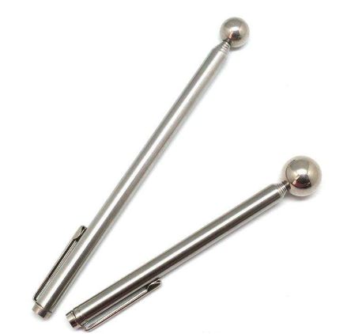
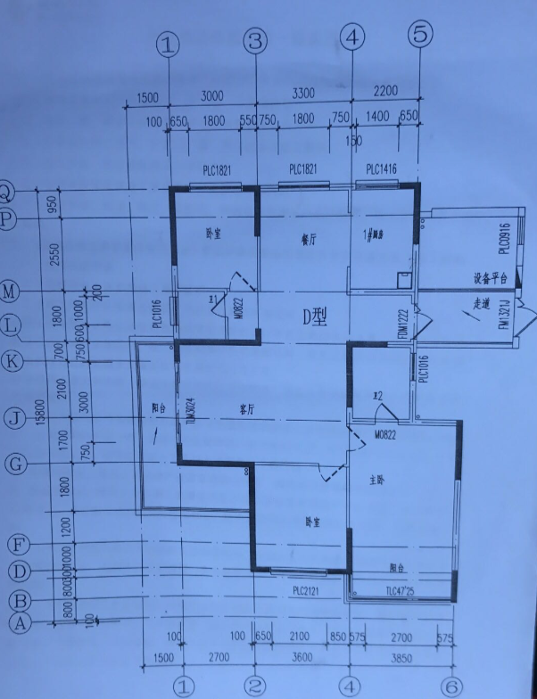

经历过一次装修，原本买啥都直接付钱，现在都习惯性的讨价还价了。都说装修烦，经历过一次，确实挺烦，但也学到很多东西。家装的过程设计到各个工序的施工方法、材料采购、进度安排。开头先说最重要的吧，工序的步骤，在一开始弄清楚，可以避免以后各种问题。

<!-- more -->

预算控制是很难的，刚开始的时候并不清楚各个环节会用多少钱，经常会出现前期花钱很豪爽，后期各种紧巴巴。每个环节都要节约，什么都要还价，很多材料都可以还到一半以上。像我家主要的大头在瓷砖、地板、木工材料。

总体工序基本原则是先上后下，先脏活后干净的活。基本顺序：墙体拆改 > 水电工程 > 中央空调安装 > 泥瓦工  > 木工 > 油漆工 > 厨房台面 > 集成吊顶、地板打楞 > 门套、窗套安装  > 墙纸、墙布 > 地板、踢脚线 > 房门安装、灯开关安装、柜门安装、马桶、浴缸、水龙头、淋浴房移门、衣柜移门安装 > 家具进场。

一般来说门套、窗套安装完后，油漆工还要来一趟补一次缝。如果墙壁贴砖的话，木工结束后，泥瓦匠要来一趟，再柜子上补贴瓷砖，不然很丑。

# 1、房屋验收

房屋验收主要看窗户、门有没有破损变形，开闭有没有问题。然后看看墙壁有没有空鼓，可以再淘宝买个下面这种可伸缩的空鼓锤，后面瓷砖贴好完也要用到。再看看厕所的下水管道有没有堵住，下雨天来看看窗户、烟道漏不漏水。

# 2、**墙体拆改**

基本上每家都会拆或者加建新墙，一定要提前设计，可以找装修公司出设计方案。不要相信工人说的他们经验丰富，看得多见的广，都懂，不用设计。工人大部分都是怎么省事怎么来做。设计确定好了，就要坚持按图施工，不要图省事来做。

一般步骤是，先找物业拿到房屋的图纸，确定哪些墙可以拆，哪些不能拆。一般黑色粗线的是承重墙，不能拆，其他都可以拆。

# 3、水电工

水电是隐蔽工程，一定要提前考虑好插座、开关、灯、冷热水的位置，一旦贴了瓷砖就改不了了。至于多留插座，厨房用带开关插座之类的网上也很多了，就不多说了。有一点要注意，如果是想要镜前灯、壁灯、厨房台面灯、鱼缸，都要提前留出线或者插座的位置。

安装暗盒前，水电工应该打激光弹水平线，这样才能保证开关插座不会是斜着的，且都在同一高度。暗盒如果斜了，装面板时可以微调，但只有1cm来去，所以一定要保证水平。所有的开关离地高度应该一样，插座离地高度也是一样，冷热水管出水口高度保持一样，如果不一样，一定要让水电工整改。

水管线管可以走地，也可以走吊顶。走吊顶水管漏了还可以换，走地的话就需要砸开瓷砖，代价比较大。一般来说水管不会坏，走吊顶施工比较麻烦，有的水电工不会高兴这么做。个人偏向于走吊顶，可以节约地面高度，后期地面找平也容易。

可视门铃、强电箱、弱电箱，设计的时候需要考虑到会不会被柜子挡住，如果挡住了，就要让水电工迁移到别位置。

4、泥瓦工

施工前跟师傅说明，水泥用的要足，不要有空鼓。施工时，需要盯着有缝不齐及时提出来。如果是一个好的师傅，就不需要这么麻烦了。

落水管道要让瓦工师傅砌砖包转，不会有后遗症。有的人会用隔音棉包住管道再砌，据说是隔音效果更好，我没有弄不知道效果怎么样，不过隔音棉不贵。烟道最好也用砖头包一遍，可以防止漏水。

# 5、木工

吊顶总的原则就是房间、客餐厅尽量高，吊顶的目的是包住不好看的管道、线、梁。前期要装中央空调，也要提前找木工师傅确认，确定出风口、进风口、维修口的位置，这样吊顶才不会有问题。

厨房台面的高度还是以女主人身高为主，炒菜时手肘成90度，不费力。洗碗区高度最好比烧菜区高15厘米左右，洗碗的时候不用弯腰。

我家是自己打的橱柜衣柜，定制的柜门，买的现成的洗脸池、洗衣池。事后觉得洗脸池、洗衣池还是一起做了比较统一，桌面都用大理石，成本也不贵。当然定制更好，成本也贵。

# 6、油漆工

现在大部分都会贴墙纸或者墙布，面漆也都是机器喷的，油漆工的活其实也不多。验收的话主要看墙面平不平，有没有突出的点没有磨平。平整度可以用长的直木条靠墙看有没有间隙。等安装完门框，插座，油漆工还要再来补一次缝。

# 7、成品安装

房门安装：门的左右缝隙应该都是5mm以上，留出足够的空间。线条与墙贴和，保持90度直角。应该先说清楚，墙壁不直不要按墙壁来装，先找油漆匠粉平墙面，再装套。如果地板通铺客厅、房间，一定要先打地楞再装门框，门等铺完地板再装。我这里吃了亏，导致现在门关不上，还在扯皮，切记啊。

厨房台面：台面材质有石英石、钢等，石英石主要看密度，密度越高越不容易吸色。可以掂掂重量是否很沉、摸摸是否光滑来判断、买了以后可以倒上酱油，静置24小时，看是否吸色。

集成吊顶：主要是铝扣板、龙骨、电器。铝扣板要厚，标准6mm。龙骨要厚，1cm。