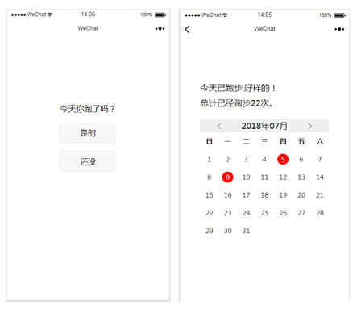
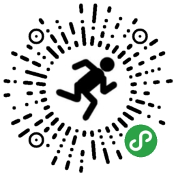

想做一个记录自己是否跑步的小工具，我的理念是：每天只要跑就是很棒，不关注公里数，每天坚持做一个事情就值得鼓励。通过记录坚持了多少天，形成一个正反馈循环，获得成就感。

<!-- more -->

整个功能就两个主界面：记录界面和统计界面，记录界面点击后跳转到统计界面，统计界面显示总的跑步次数，和日历展示是否跑步，日历中跑步的日子会用红圈圈出来。

点了是的按钮后会读取微信运动的步数，获取当天走了多少步，虽然转换不成公里数，但可以知道当天运动强度。还会读取当前位置，后续功能扩展打算做一个地图，每在一个省跑过，就点亮一块地图，全部点亮则达成跑完中国成就。

下面是小程序码。

