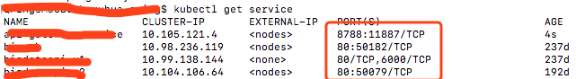
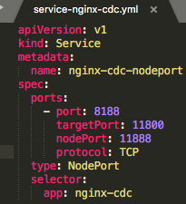

记录下 kubernetes 打包发布应用的经过～

<!-- more -->

# 1、应用打包

maven应用 package生成jar包

vuejs应用 npm run watch生成 dist 静态文件目录

# 2、打包镜像

编写 Dockerfile

```
FROM java:8
WORKDIR /
ADD target/service-*.jar app.jar
CMD java -jar app.jar --spring.profiles.active=prod
```

编写 docker-compose.yml

```
app-service-cdc:
    build: 
      context: /path/to/app-service
      dockerfile: /path/to/app-service/Dockerfile
    image: app-service
    container_name: app-service
    environment:
      - redis_port=6379
      - redis_host=redis
    ports:
      - 8091:8091
    networks:
      - net
    links:
      - redis
    depends_on:
      - redis
```

运行docker-compose，生成镜像

```
# 执行
docker-compose up 

# mac查看端口是否使用
lsof -i:8080
```

# 3、docker相关命令

```
# 将镜像放入容器，并启动（相当于 docker create 后执行 docker start）
docker run -p 8080:80 --name nginx_web -it nginx /bin/bash
docker run -p 8080:80 -d nginx:latest

# 显示容器信息，包含ID
docker ps -a

# 停止容器
docker stop nginx_web

# 启动容器
docker start nginx_web

# 进入容器
docker attach 44fc0f0582d9
docker exec -it 44fc0f0582d9 /bin/bash

#删除 nginx 相关容器、镜像
docker ps -a | grep nginx | awk '{print $1}' | xargs docker stop
docker ps -a | grep nginx | awk '{print $1}' | xargs docker rm
docker image list | grep nginx | awk '{print $3}' | xargs docker rmi
docker rmi $(docker images -f since=redis:3.2)
docker logs -tf --tail 10  18659a8bb3b4
```

# 4、上传镜像

```
# 需要先在docker中注册docker ID，并登陆
docker login
# tag（一定要加上自己的DockerID作为前缀，如: qping/ ）
docker tag nginx qping/nginx_test
# push
docker push qping/nginx_test
```

# 5、发布应用

可视化界面,可以很直观的看到Kubernetes各个容器、deploy、service的状态

```
# 安装
kubectl create -f https://raw.githubusercontent.com/kubernetes/dashboard/master/src/deploy/recommended/kubernetes-dashboard.yaml
# 查看端口
kubectl get service --namespace kube-system
# 浏览器访问
http://192.168.10.45:30000/
```

安装和服务器版本相同的 kubectl

```
curl -Lo kubectl http://storage.googleapis.com/kubernetes-release/release/v1.7.5/bin/darwin/amd64/kubectl && chmod +x kubectl && sudo mv kubectl /usr/local/bin
```

查看配置

```
kubectl config view
```

查看与修改 namespace

```
# 修改context的默认namespace
kubectl config set-context $(kubectl config current-context) --namespace=service-default
kubectl get namespace
```

查看 pod 和 deploy

```
# pod查看
kubectl get pod

# 查看指定namespace下的pod
kubectl get pod --namespace service-default

# 查看deployment
kubectl get deployment
```

部署 deployment 和 service

```
# 比对下客户端和服务器版本是否一致，如果不一致可能出现提示成功但实际没有删除的情况（ GitVersion ）
kubectl version
# 发布deployment
kubectl apply -f deploy-nginx-test.yml --record
# 发布service
kubectl apply -f service-nginx-test.yml --record
# 删除错误的 deloyment（会同时删除pod，命令执行后需要一段时间生效，大约10秒钟）
kubectl delete deployment app-cdc
```

调试与查看

```
# 转发 pod 中的 6000 端口到本地的 5000 端口
kubectl port-forward my-pod 5000:6000

# 进入到pod内部
kubectl exec -it my-pod bash
```


# 6、问题调试

部署完果然还是出了问题。

## 6.1 Springboot项目启动时log4j内存溢出

主要是jar冲突了，修改pom.xml，排除掉srpingboot的logging jar包

```
<dependency>
      <groupId>org.springframework.boot</groupId>
      <artifactId>spring-boot-starter</artifactId>
      <exclusions>
          <exclusion>
              <groupId>org.springframework.boot</groupId>
               <artifactId>spring-boot-starter-logging</artifactId>
          </exclusion>
      </exclusions>
</dependency>
```

## 6.2 发布后nginx无法访问

可能原因：service和deployment的selector不一致，导致nignx无法访问

```
apiVersion: v1
kind: Service
metadata:
  name: nginx-test-service
spec:
  ports:
    - port: 8188
      targetPort: 11800
      nodePort: 11888
      protocol: TCP
  type: NodePort
  selector:
    app: nginx-test # 此处的app: nginx-test 一定要和deployment中的对应
```

## 6.3 发布后服务无法访问

可能原因1: service 端口映射错误

```
# 查看映射端口是否正确
kubectl get service
```





如果修改  svc-xxx.yml 配置，重新apply

```
port是k8s使用的端口
targetPort是内部服务端口
nodePort是对外服务端口
```





可能原因2:pod启动报错，查看日志，并修正错误

```
# 获取pod信息
kubectl get pod
# 显示日志
kubectl logs {Pod Id}
# 如果是数据库连不上，可以进入pod后，ping一下数据库ip，看是否可以ping通

kubectl get pod
```