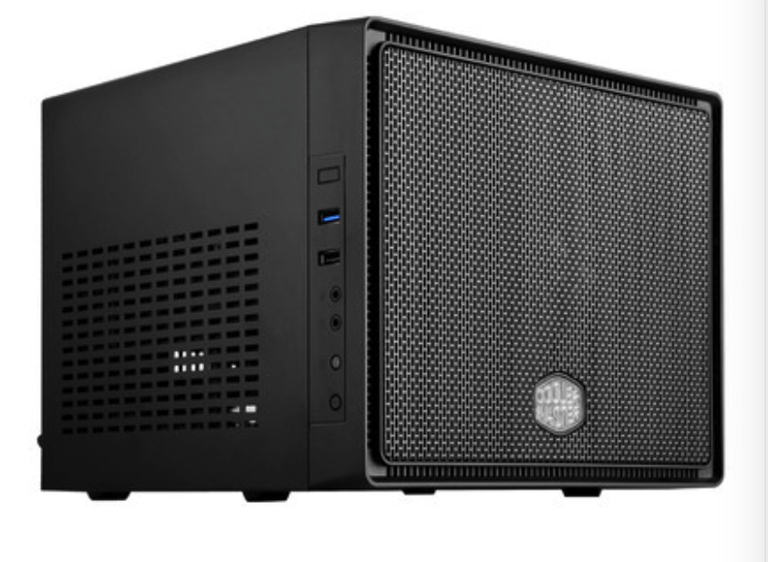
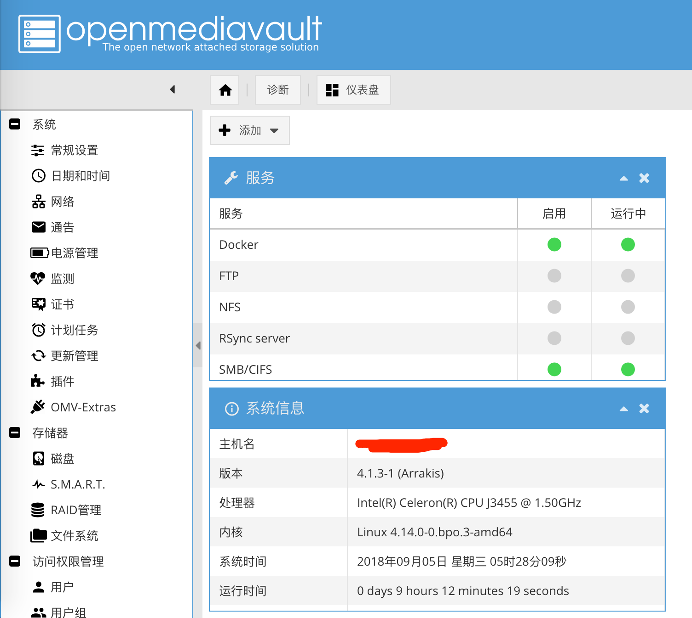
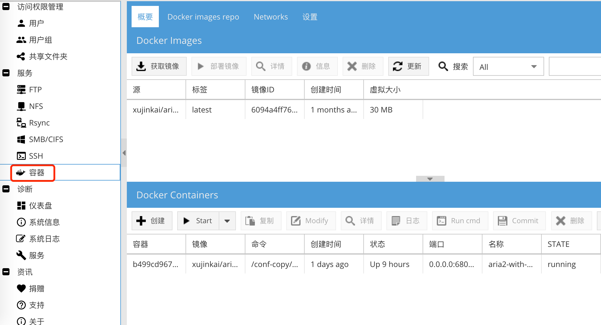

因为某些原因（qiong），一直想弄一台 NAS，但都没有下手。群晖价格在 4000 以上的机型，CPU 都是 J3455，淘宝价只要 599，真是黑啊，还是自己买零件组装吧。本来想买性能更好的 J4105，但它需要ddr4的内存条，我旧笔记本的内存条是 ddr3 的，现在内存条这么贵的情况下，不打算再买新内存了。

<!-- more -->

# NAS组装

整个配下来花了990，具体配置如下：

1、CPU：J3455，1.5GHZ，价格 599，购买链接： [二手东](https://item.jd.com/26729108099.html)

2、电源：航嘉 300w，价格 149，购买链接：[天猫](https://detail.tmall.com/item.htm?id=560932118166&spm=a1z09.2.0.0.67002e8d5T0vkf&_u=5msm8use069)

3、机箱：酷冷至尊小魔方，价格 239，购买链接：[天猫](https://detail.tmall.com/item.htm?id=568207014801&spm=a1z09.2.0.0.67002e8d5T0vkf&_u=5msm8us583c&skuId=3795802759717)

4、内存：ddr3 8g（旧笔记本上的）

5、硬盘：三星 840pro 120G 固态硬盘作为系统盘 ，金士顿1T 机械硬盘 作为数据盘（都是旧笔记本的）

最终模样：




# 操作系统

系统装了omv（openmediavault），omv、freenas、nas4free其实都是兄弟，omv系统配置要求比较低。我要吐槽的是Mac上想刻一个系统盘好困难，最后还是借了同事的windows刻了系统盘。

系统装完后，直接在浏览器输入NAS的IP地址，就可以进入web管理页面，默认登陆用户是admin，密码是openmediavault。长下面这个样子，还是挺漂亮的。




# 插件安装

1、omv-extras

先要装omv-extras来管理插件，我的是系统版本是omv4，要选择[对应版本的插件](https://www.openmediavault.cn/read-4.html)，不然不兼容。

```bash
wget http://omv-extras.org/openmediavault-omvextrasorg_latest_all4.deb 
dpkg -i openmediavault-omvextrasorg_latest_all4.deb 
apt-get update
```

2、docker

docker无所不能。安装完omv-extras后，web管理界面左侧就会多一个OMV-Extras，点进去把Docker-CE打开。然后安装openmediavault-docker-gui。

可以ssh远程命令安装

```bash
apt-get install openmediavault-docker-gui
```

或者在web管理界面，插件中搜索docker-gui安装，安装完毕，右侧会多一个容器。




3、docker中安装aria2

安装docker以后就可以装各种镜像了，aria2当然必不可少，下载必备。可以直接在容器>右上角搜索aria2，也可以ssh远程命令拉取镜像。

```bash
docker pull xujinkai/aria2-with-webui
```

安装完以后配置镜像，第一次配置找的网上的教程说的云里雾里的，怎么都不对，后来直接上docker的官网，看这个[镜像的说明](https://hub.docker.com/r/xujinkai/aria2-with-webui/)，才知道原来是这么回事，需要先新建一个`aria2.conf`，[配置样例](https://raw.githubusercontent.com/qpingcode/demo/master/aria2.conf)，然后用命令行启动：

```bash
sudo docker run -d \
--name aria2-with-webui \
-p 6800:6800 \
-p 6880:80 \
-p 6888:8080 \
-v /DOWNLOAD_DIR:/data \
-v /CONFIG_DIR:/conf \
-e SECRET=YOUR_SECRET_CODE \
xujinkai/aria2-with-webui
```

4、安装115Exporter

直接用aria2下载是很慢的，可以通过aria2下载115网盘或者百度网盘的东西，速度就快很多了。115网盘可以淘宝买会员。先安装个chrome插件，进入115网盘后，就会多一个按钮：导出下载。先设置下aria服务器地址，然后导出下载>aria2 rpc，就可以下载了。

[Chrome插件地址](https://chrome.google.com/webstore/detail/115exporter/ojafklbojgenkohhdgdjeaepnbjffdjf)  [GitHub地址](https://github.com/acgotaku/115)