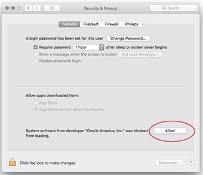

kubernetes 的安装部署很复杂，构建一个集群的话至少需要三台服务器，为了便于新手学习，所以 kubernetes 提供了 minikube 用于学习和试验。

<!-- more -->

minkube 需要首先安装 virtualBox，可以通过 `brew cask install virtualbox` 安装。安装时会因为安全校验被 MacOS 拦截，提示安装失败。点击 allow 后，再执行一次 brew 安装就可以了。



然后下载 minikube 

```bash
curl -Lo minikube http://kubernetes.oss-cn-hangzhou.aliyuncs.com/minikube/releases/v0.28.0/minikube-darwin-amd64 && chmod +x minikube && sudo mv minikube /usr/local/bin/
```

然后通过镜像启动

``` bash
 minikube start --registry-mirror=https://registry.docker-cn.com
```

可以看到日志里面先下了一个 Minikube 的镜像，然后下载 kubeadm 和 kubelet，然后提示 kubectl 可以使用了。

``` bash
Starting local Kubernetes v1.10.0 cluster...
Starting VM...
Downloading Minikube ISO
 153.08 MB / 153.08 MB [============================================] 100.00% 0s
Getting VM IP address...
Moving files into cluster...
Downloading kubeadm v1.10.0
Downloading kubelet v1.10.0
Finished Downloading kubelet v1.10.0
Finished Downloading kubeadm v1.10.0
Setting up certs...
Connecting to cluster...
Setting up kubeconfig...
Starting cluster components...
Kubectl is now configured to use the cluster.
Loading cached images from config file.
```

查看下 dashboard ，确定已经成功安装了。

``` bash
minkube dashboard
```

