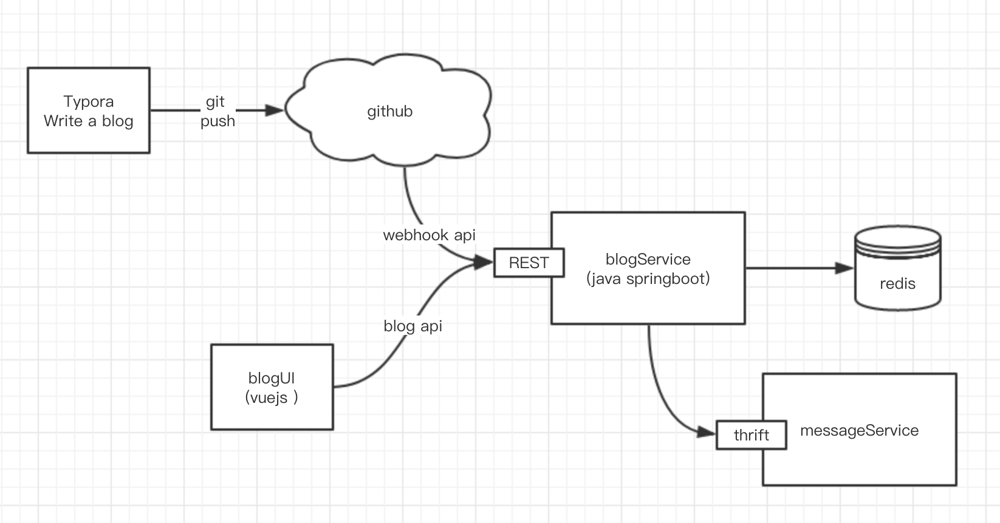
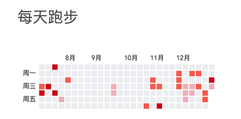

新的架构是目前为止最符合我心目中所想像的博客的样子：通过 Git 可以备份博客内容和修改历史，博客格式为 Markdown，普通的文本编辑器就可以编辑和查看，如果以后迁移博客也很方便。引入了一些微服务的内容，简化运维的工作量。好了，这次以后再不折腾博客程序了。

<!-- more -->

原有的架构有很多问题，比如小程序后台和博客都在一个项目中，如果我想要更新其中一个，另外一个就会受影响。又比如，博客后台权限设计的过于复杂，导致我没有兴趣再继续开发。最近用到了springboot特别喜欢，微服务让我们能够运维和开发的泥潭中脱离，更快的开发和迭代。重新设计完的整体架构如下图。




首先是写博客摒弃了网页富文本编辑器，使用 Typora ，一款 Mac 版的 Markdown 编写工具，能够支持图片的粘贴上传，界面也很合我的胃口。博客的一些配置信息如：英文标题、修改时间、所属标签，放在markdown的头部，格式为 yaml，比如本篇博客的头部信息如下图，后台服务将 markdown 文件转成 html 时，会读取这些配置信息。

``` yaml
title: blog code refactoring
modify: 2018-12-16 08:00:00
plugin: false
tags:
 - blog
 - refactoring
```

前端页面使用 vue 来开发，单页面网站没法生成TDK，对SEO不怎么友好，不过无所谓，反正是一个个人使用的博客。实现了一款博客插件加载功能，在markdown中可以用标签  `<plugin/> `来定义需要使用的插件，范例如下：

``` html
<plugin name="run_activity_list" params="{month:'6',color:'red'}"></plugin>
```

在浏览器中加载博客时会扫描 ` <plugin/> ` 标签，如果有则根据 name 加载对应的插件 js，在插件 js 中渲染想要的效果。比如下面是实现了在博客中展示我的跑步记录的统计图。




后台服务使用 springboot 来开发，所有的API 被设计成 REST 风格。将原来的邮件通知和短信通知抽离出博客系统，以后写其他的应用也可以使用消息服务。使用 google 的 rpc 框架 thrift 做服务间的调用。博客服务、前端服务、消息服务都通过 docker 打成镜像，上传至服务器运行。