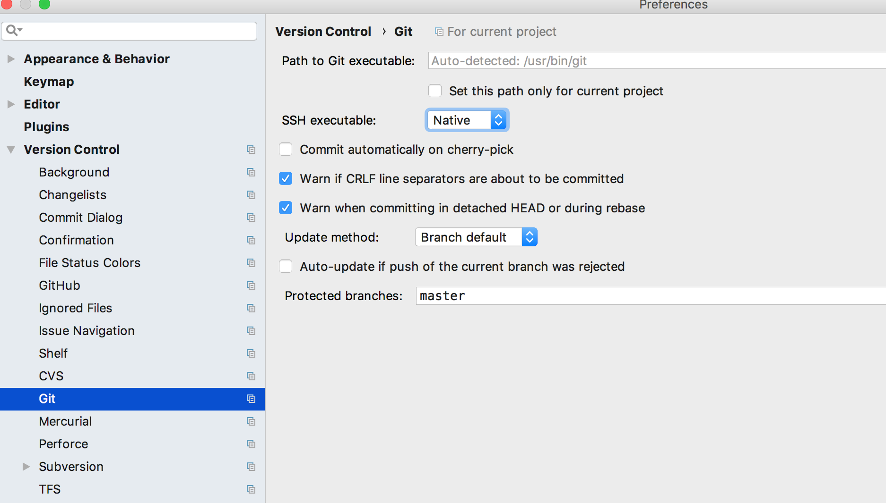

最近公司代码库迁移了，从原来的 github 迁移到自己的服务器上。将原来的 origin 地址 rename 后增加了新的 git 地址。修改完以后发现在 intellij 中无法 fetch、pull 和 push。

<!-- more -->

```
cd com-services
git remote rename origin old-origin
git remote add origin git@new.company.site:group/com-services.git
```


# 1、 第一波问题：ssh代理问题

ssh_key 之前已经配置过，所以肯定不是验证的问题。想到原来地址是用的 http 协议，现在改为了 ssh 协议，怀疑是 ssh 的问题。

使用命令  `ssh -vvv git@github.com` 可以看到 git 通过 ssh 连接时的 debug 信息。

```bash
$ ssh -vvv git@github.com
OpenSSH_7.6p1, LibreSSL 2.6.2
debug1: Reading configuration data /etc/ssh/ssh_config
debug1: /etc/ssh/ssh_config line 48: Applying options for *
debug1: /etc/ssh/ssh_config line 51: Applying options for github.com
debug1: Executing proxy command: exec connect-proxy -H 127.0.0.1:1086 github.com 22
debug1: identity file /Users/qping/.ssh/id_rsa type 0
debug1: key_load_public: No such file or directory
debug1: identity file /Users/qping/.ssh/id_rsa-cert type -1
debug1: Local version string SSH-2.0-OpenSSH_7.6
debug1: permanently_drop_suid: 502
/bin/bash: line 0: exec: connect-proxy: not found
ssh_exchange_identification: Connection closed by remote host
```

可以看到提示 connect-proxy 命令找不到，原来很久之前设置过一次 ssh 代理，当时就改错了，但没有发现这个错误。

```bash
sudo vim /etc/ssh/ssh_config
```

把文件最后的

```properties
Host github.com *.github.com
   ProxyCommand connect-proxy -H 127.0.0.1:1086 %h %p   #设置代理
   IdentityFile ~/.ssh/id_rsa
   User git
```

改为

```properties
Host github.com *.github.com
   ProxyCommand nc -v -x 127.0.0.1:1086 %h %p   #设置代理
   IdentityFile ~/.ssh/id_rsa
   User git
```

重新执行：`ssh -vvv git@github.com`，这次出现了更多的 debug 信息，最后提示成功验证了。


```bash
Hi XXX! You've successfully authenticated, but GitHub does not provide shell access.
```

# 2、 第二波问题：intellij ssh执行问题

再去 intellij 中试了下，还是不成功，明明可以用命令行更新与提交，但 intellij 中提交时等了很长时间，报出一个错误。

```bash
Could not read from remote repository
```

怀疑是 intellij 使用了内嵌的 ssh，和命令行中执行的 ssh 是不一样的。果然有个配置 SSH executable，将 build-in 改为 Native 后。就可以使用 git clone git@github.com:qingcode/test.git 了，也可以 commit 与 push。




# 3、 第三波问题：公司代理没开

在 github 上测试下载和提交代码都成功了。然后我去试了下公司的代码 push，intellij 中 push 很久之后，还是报错：

```bash
Could not read from remote repository
```

原来是之前刚刚试验了重启大法，电脑重启后公司 vpn 没开，连不上公司 Git 服务器导致的。