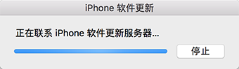
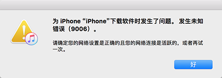

不知道为何iphone我用着用着就突然关机了，按任何按键都没有反应，也充不进电，变成了一块板砖。查了下应该是进入*DFU*模式。

 <!-- more -->

# 尝试恢复

连接itunes果然提示是否恢复，然后就尝试了下点击恢复，长时间卡在联系软件更新服务器界面，尝试修改DNS为114.114.114.114，这一步就快了。

下载固件时，经常出现9006错误，可能是网络不稳定。

大约30分钟后下载成功了，然后尝试恢复了大概10次，一直报4014错误，大概率是硬件问题了。

# 修手机

附近没有天才吧，只有万邦，收费至少1500，而且得返厂检测。这个价格还不如直接换手机了。

在路边又找了个几平米的修手机的小店，进门就见到一个中年大妈坐镇店中，一头波浪卷，这不是想象中的修手机该有的样子啊，抱着侥幸的心理还是咨询了下。再告知怀疑是硬件问题后，大妈说她试一下，修不好不收钱。然后果然她打开了个软件，然后点了下恢复。在失败了3次后，大妈放弃了，带着我去找高手。

在后面的小巷子里，不起眼的店面，里面有几张工作台，非常杂乱放着一堆拆散的苹果手机和平板，各种芯片。侧边还有台显示器，显示的是iphone的主板电路图。感觉到了靠谱的味道。帮我修的是个中年胖子，有点唏嘘的胡渣，圆脸短发，疑似广西口音，业务非常繁忙的样子，不停的有电话找他。告知来意后，他对着电路图用万能表测了几次，然后换了个芯片，手机就修好可以开机了。

整个过程大概在30分钟左右，收费280。估计这280里还有大妈的介绍费，但比万邦给的报价要便宜多了。

# 参考

[苹果官网恢复流程说明](https://support.apple.com/zh-cn/HT201263) 

[大妈用保资料恢复手机的工具地址](https://www.i4.cn/)

