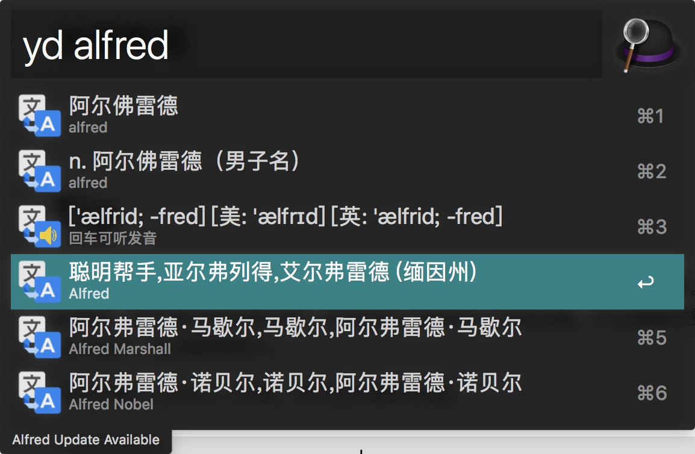

最近参加了一个左耳朵耗子发起的活动，承诺每周打卡一个ARTS，说具体就是：

- Algorithm: 做一道 leetcode 算法题
- Review: 点评一篇英文技术文章
- Tip: 学习一个技术技巧
- Share: 分享一篇有观点和思考的技术文章

<!-- more -->

# Algorithm

[求数组中的元素除了自身的乘积](https://leetcode.com/problems/product-of-array-except-self)：给定一个数组 A，例如 [1,2,3,4]，求一个返回数组 B，B[i] 等于A中所有元素的乘积 ( 除了A[i] )。但是限定了算法复杂度是 O(n)，所以不能用两层循环嵌套。也限定了不能用除法，不能将A所有元素相乘，再循环除 A[i]，得出结果。

最后的解题思路是从左到右挨个求出一个数组，再从右到左求出一个数组，每一项的值都是之前所有值的乘积，B[i] = left[i - 1] * right[i -1]。

最后的算法实现如下，这个实现在计算从右到左的数组时，就将结果计算出来了，省略了一个中间数组，减少了一遍循环。

``` java
class Solution {
     public int[] productExceptSelf(int[] nums) {
        int len = nums.length;
        int [] output = new int[len];
        output[0] = 1;

        for(int i = 1; i < len; i++){
            output[i] = output[i - 1] * nums[i - 1];
        }

        int right = 1;
        for(int j = len - 1; j >= 0; j --){
            output[j] = output[j] * right;
            right = right * nums[j];
        }
        return output;
    }
}
```


# Review

英文文章挑了一篇阮一峰的每周分享，是一篇介绍 python 的数学计算库 : [numpy](https://www.pythonprogramming.in/numpy-tutorial-with-examples-and-solutions.html) 。

NumPy 是一个开源的 python 工具库，它能够操作多维数组，提供很多有用的数学函数，包括线性代数和诸如傅立叶变换、随机数生成等复杂数学操作。很多数学分析库都用到了 numpy  ，比如： scikit-learn、SciPy 和 Pandas。

文章介绍了 Numpy 创建数组、重新改变数组形状、随机生成数组、下标访问多维数组、多维数组的分割与合并、线性代数计算。

简而言之，对于 numpy 是一个很好的多维数组操作工具类。这篇文章是一个很好的教程文档。


# Tip

今天装了一个应用 Alfred，官方介绍是效率工具，能够让你抛弃鼠标的神器。包含搜索、快速启动、计算器、网页搜索、历史剪切板等等功能，还有自定义插件的工作流功能，不过需要收费版才能使用。可以完全替代苹果的 Spotlight，且功能更强大。

安装后通过 Option + 空格，即可呼出使用界面。自定义插件流太好用了，找了个有道翻译的工作流，通过yd + 想翻译的词，就可以快捷翻译啦。




# Share

没有想好要分享什么，分享下 awk 的使用吧，可能缺少观点和思考，更类似于技巧的分享。

在最近一直使用 kubernetes 来部署应用，由于需要部署很多个微服务，给我感觉像是个重复劳动体力活，很困扰。直到发现 awk 这个神器。

先举个例子，比如我要删除掉所有版本号为 none 的镜像，然后 push 所有相关的镜像到私服，然后创建deployment 和 service，只要下面几个命令。

```
cd k8s-deploy/
docker images | grep none | awk '{print $3}' | xargs docker rmi
docker images | grep njwjw-1.0 | awk '{print "docker push "$1":"$2}' | sh
ls -l | awk '{if($9)print "kubectl apply -f "$9" --record"}' | sh
```

这三个命令都是相似的，通过管道符 `|` 将，前一个命令的输出作为后一个命令的输入。 通过 `awk` 对于输出的字符串进行处理。处理完毕后，调用 `xargs` 或者 `sh` 来执行。

`awk` 是文件处理命令，可以对逐行分析文本，把内容提炼和加工成最终想要的格式。

`awk '{print $1,$2}' 1.txt`   默认通过空格分割，通过 `$` 加上索引位置获取对应的字符串

```
# qping @ QPingsMacBook in ~ [22:46:40]
$ cat 1.txt
10 20,40 30
11 21,41 31
12 22,42 32

# qping @ QPingsMacBook in ~ [22:46:41]
$ awk '{print $1,$3}' 1.txt
10 30
11 31
12 32
```

`awk -F,` 可以修改默认的分隔符为逗号，`awk -F '[ ,]'` 或者指定先按空格分割，然后按逗号分割

```
$ awk -F '[ ,]' '{print $1,$3}' 1.txt
10 40
11 41
12 42
```

`awk -v` 可以设置变量

```
$ awk -v a=12 '{print $1+a}' 1.txt
22
23
24
```

上面的例子使用了 `+` 来计算加法，`awk` 还支持很多其他运算符。

| 运算符          | 赋值                             |
| --------------- | -------------------------------- |
| ?:              | C条件表达式                      |
| \|\|            | 逻辑或                           |
| &&              | 逻辑与                           |
| ~ ~!            | 匹配正则表达式和不匹配正则表达式 |
| < <= > >= != == | 关系运算符                       |
| 空格            | 连接                             |
| + -             | 加，减                           |
| * / %           | 乘，除与求余                     |
| + - !           | 一元加，减和逻辑非               |
| ^ ***           | 求幂                             |
| ++ --           | 增加或减少，作为前缀或后缀       |
| $               | 字段引用                         |
| in              | 数组成员                         |

```
$ awk '$1>10 {print $1}' 1.txt
11
12
```

另外还可以使用正则，还可以编写 awk 脚本。可参考[这里](http://www.runoob.com/linux/linux-comm-awk.html)

