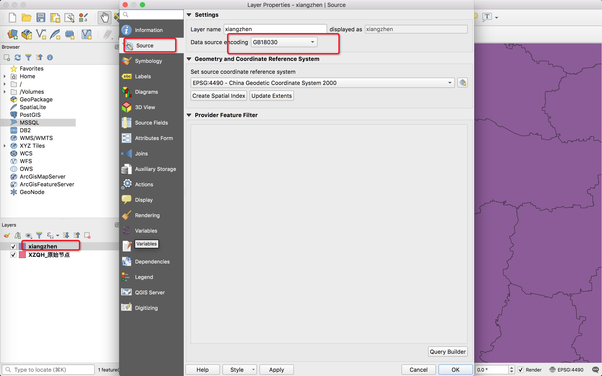
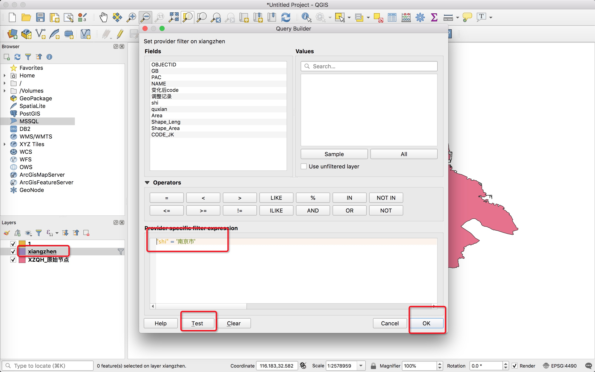
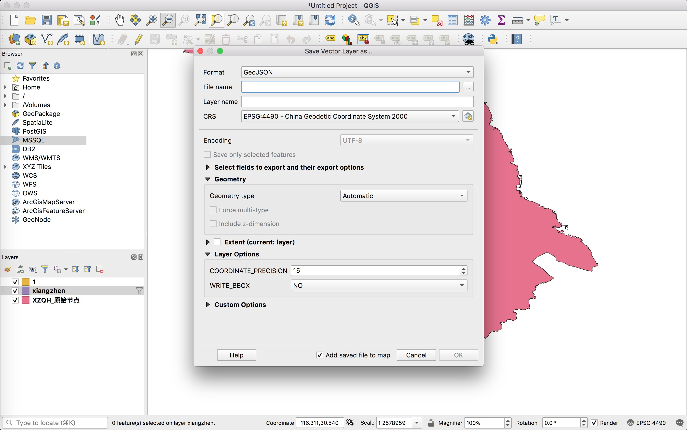

QGIS可以使用 Shapefile、Coverage 和 Personal Geodatabase 格式的数据。它也支持 MapInfo、PostGIS 和许多其他格式。QGIS也支持包括 Web 地图服务及 Web 特性服务的 Web 服务，以此来使用外部来源的数据。

<!-- more -->

1、 安装报错，需要python3

https://www.python.org/downloads/mac-osx/

下载python3.6.6安装，`brew install` 的 python 无效

2、中文乱码

Layers > 选择想要的图层右键 > 属性 > Source > Data source encoding 改为 GB18030

3、过滤南京数据

Layers > 选择想要的图层右键 > fitler > 输入 filter expression > Test 点击后可以看到筛选了多少数据  > OK 确认选择

4、导出为geojson

Layers > 选择想要的图层右键 > Export > Save Features As >  Format 选择 GeoJSON > OK 确认导出

