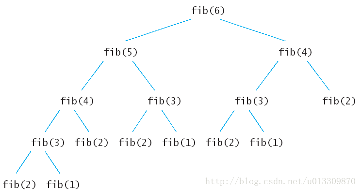

# 1、动态规划

动态规划的核心是通过把原问题分解为相对简单的子问题的方式求解复杂问题的方法。适用于有重叠子问题和最优子结构性质的问题。动态规划所耗的时间往往远少于朴素解法。

<!-- more -->

动态规划背后的基本思想非常简单。大致上，若要解一个给定问题，我们需要解其不同部分（即子问题），再根据子问题的解以得出原问题的解。

通常许多子问题非常相似，为此动态规划法试图仅仅解决每个子问题一次，从而减少计算量：一旦某个给定子问题的解已经算出，则将其记忆化存储，以便下次需要同一个子问题解之时直接查表。这种做法在重复子问题的数目关于输入的规模呈指数增长时特别有用。

[以上摘抄自维基百科](https://zh.wikipedia.org/wiki/%E5%8A%A8%E6%80%81%E8%A7%84%E5%88%92)


## 两种形式

动态规划求解的方式有两种：① 自顶向下的备忘录法 ；② 自底向上。

为了说明动态规划的这两种方法，举一个最简单的例子：求斐波拉契数列 **Fibonacci** 。

斐波拉契数列 指的是这样一个数列：1、1、2、3、5、8、13、21、34、……在数学上，斐波纳契数列以如下被以递推的方法定义：
$$
F(1)=1，F(2)=1, F(n)=F(n-1)+F(n-2)（n>=3，n∈N*）
$$
使用递归来实现这个算法特别简单：

```java
public int Fibonacci(int n){
	if(n <= 2) return 1;
	return Fibonacci(n - 1) * Fibonacci(n - 2);
}
```

先来分析一下递归算法的执行流程，假如输入6，那么执行的递归树如下：



上面的递归树中的每一个子节点都会执行一次，很多重复的节点被执行，fib(2) 被重复执行了 5 次。由于调用每一个函数的时候都要保留上下文，所以空间上开销也不小。这么多的子节点被重复执行，如果在执行的时候把执行过的子节点保存起来，后面要用到的时候直接查表调用的话可以节约大量的时间。下面就看看动态规划的两种方法怎样来解决斐波拉契数列 Fibonacci 数列问题。

① 自顶向下的备忘录法

```java
public static int Fibonacci(int n) {
    int[] memo = new int[n + 1];
    return Fibonacci(n, memo);
}

public static int Fibonacci(int n, int[] memo) {
   if (memo[n] != 0) return memo[n];
   if (n <= 2) {
     memo[n] = 1;
   } else {
     memo[n] = Fibonacci(n - 1, memo) + Fibonacci(n - 2, memo);
   }
   return memo[n];
}
```

备忘录法也是比较好理解的，创建了一个 n + 1大小的数组来保存求出的斐波拉契数列中的每一个值，在递归的时候如果发现前面 Fibonacci（n）的值计算出来了就不再计算，如果未计算出来，则计算出来后保存在 memo 数组中，下次在调用 Fibonacci（n）的时候就不会重新递归了。

② 自底向上的动态规划

```java
public static int Fibonacci(int n) {
   if(n <= 2){
     return 1;
   }
   int[] memo = new int[n + 1];
   memo[1] = 1;
   memo[2] = 1;
   for (int i = 3; i < n + 1; i++) {
     memo[i] = memo[i - 1] + memo[i - 2];
   }
   return memo[n];
}
```

自底向上的动态规划也是保存了先前计算的值，为之后的计算服务。观察到参与循环的只有 $ i , i - 1, i - 2 $ 三项，不用保存所有的中间计算结果，可以进一步压缩算法。

```java
public static int Fibonacci(int n) {
  int FN1 = 1;    // Fibonacci ( n - 1 )
  int FN2 = 1;    // Fibonacci ( n - 2 )
  int FN = 1;			// Fibonacci ( n )
  
  for(int i = 3; i < n + 1; i++){
  	FN = FN1 + FN2;
  	FN2 = FN1;
  	FN1 = FN;
  }
  return FN;
}
```

一般来说由于备忘录方式的动态规划方法使用了递归，递归的时候会产生额外的开销，使用自底向上的动态规划方法要比备忘录方法好。 

## 实际解题

某公司出售一段长度为 $ i $ 英寸的钢条，价格为 $ p_i  (  i = 1, 2, ..., n ) $ ，单位为美元。

以下给出一个价格表的样例：

| 长度 $ i $   | 1    | 2    | 3    | 4    | 5    | 6    | 7    | 8    | 9    | 10   |
| ------------ | ---- | ---- | ---- | ---- | ---- | ---- | ---- | ---- | ---- | ---- |
| 价格 $ p_i $ | 1    | 5    | 8    | 9    | 10   | 17   | 17   | 20   | 24   | 30   |

钢条切割的问题是这样的：给出一段长度为 $ n $ 英寸的钢条，和一个价格表 $ p_i ( i  = 1, 2, ..., n ) $  ，求切割钢条的方案，使得销售收益 $ r_n $ 最大。注意，如果长度为 $ n $ 英寸的钢条和价格 $ p_n $ 足够大，最优解可能就是完全不需要切割。

我们发现，将一段长度为 4 英寸的钢条切割为两段各长 2 英寸的钢条，将产生 $ p_2 + p_2 = 5 + 5 = 10 ​$ 的收益，为最优解。

更一般的，对于 $ r_n (n > 1) $ ，我们可以用更短的钢条的最优切割收益来描述它：
$$
r_n = max(p_n, r_1 + r_{n-1},r_2 + r_{n-2}, ..., r_{n-1} + r_1)
\tag{1}
$$


第一个参数 $ p_n $对应不切割，直接出售长度为 $ n $ 英寸的钢条的方案。其他 $ n-1 $个参数对应另外 $ n-1 $ 种方案: 对每个$ i=1,2,…,n-1 $ ，首先将钢条切割为长度为 $ i $ 和 $ n-i $ 的两段,接着求解这两段的最优切割收益 $ r $ 和 $ r_{n-i} $ ( 每种方案的最优收益为两段的最优收益之和 )。由于无法预知哪种方案会获得最优收益，我们必须考察所有可能的 $ ， 选取其中收益最大者。如果直接出售原钢条会获得最大收益，我们当然可以选择不做任何切割。

先计算子问题的最优解，并在所有可能的两段切割方案中选取组合收益最大者，构成原问题的最优解。我们称钢条切割问题满足最优子结构 ( optimal substructure ) 性质：问题的最优解由相关子问题的最优解组合而成，而这些子问题可以独立求解。

除了上述求解方法外，钢条切割问题还存在一种相似的但更为简单的递归求解方法：我们将钢条从左边切割下长度为 $ i $ 的一段，只对右边剩下的长度为 $ n - i$ 的一段继续进行切割 ( 递归求解 )，对左边的一段则不再进行切割。即问题分解的方式为：将长度为 $ n $ 的钢条分解为左边开始一段，以及剩余部分继续分解的结果。这样，不做任何切割的方案就可以描述为：第一段的长度为 $ n $ ，收益为 $ p_n$ , 剩余部分长度为 0，对应的收益为 $ r_0 = 0 ​$ 。于是我们可以得到公式 (1) 的简化版本:
$$
r_n = \max \limits_{1 \le i \le n} (p_i + r_{n-i})
$$


上面的例题来自于算法导论，
